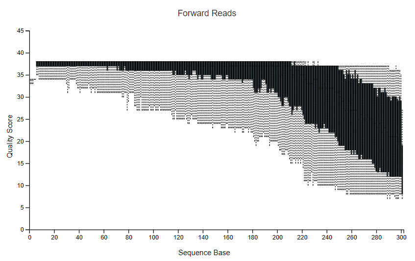
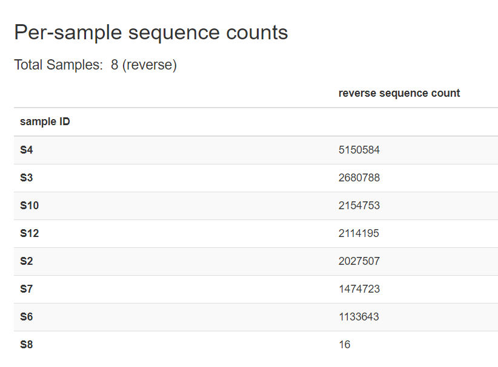
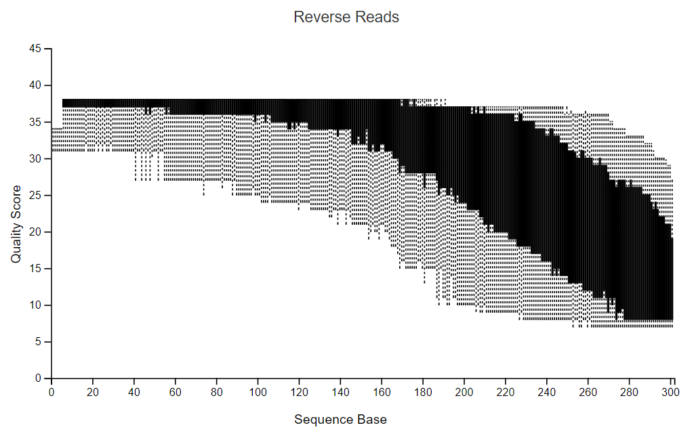
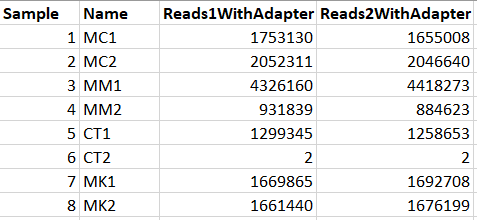
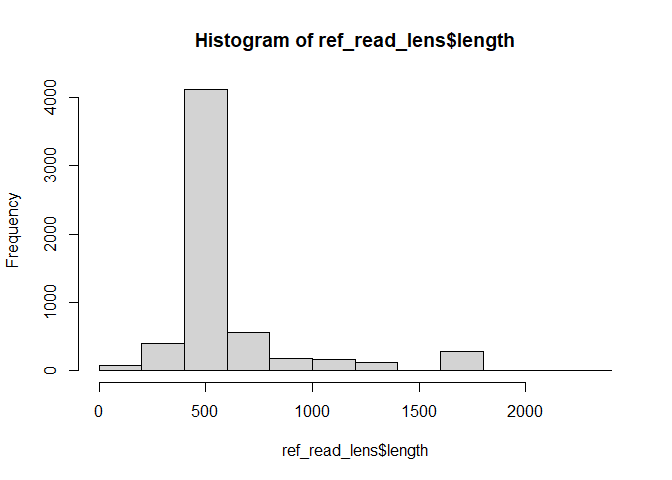
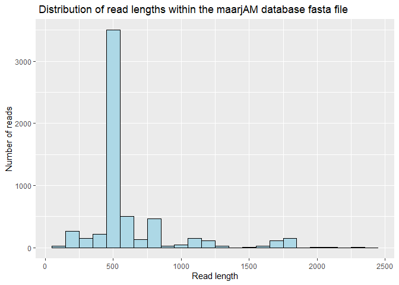

Yves Tchiechoua 18S Metegenomic analysis of Arbuscular Myrcorrhizal
Fungi (AMF) on Prunus africana Trees in Kenya and Cameroon
================
Bernice Waweru
Tue 22, Jun 2021

-   [Study details summary](#study-details-summary)
-   [Bioinformatics Analyses](#bioinformatics-analyses)
    -   [Analysis with `qiime2/2020.8`](#analysis-with-qiime220208)
        -   [Importing data into qiime2 and inspecting number and
            quality of
            reads](#importing-data-into-qiime2-and-inspecting-number-and-quality-of-reads)
        -   [Generating Feature (OTU) table with
            *Deblur*](#generating-feature-otu-table-with-deblur)
    -   [Analysis in R](#analysis-in-r)
        -   [Install the packages and prepare the input
            data.](#install-the-packages-and-prepare-the-input-data)
        -   [Use the functions](#use-the-functions)
            -   [Function `*otuReport*` to summarise the two
                datasets](#function-otureport-to-summarise-the-two-datasets)
            -   [Calculate Alpha diversity](#calculate-alpha-diversity)
        -   [Working with the merged
            dataset](#working-with-the-merged-dataset)
    -   [Taxonomic assignemnts of reads with BWA and
        BLAST](#taxonomic-assignemnts-of-reads-with-bwa-and-blast)
        -   [March 11 2021](#march-11-2021)
        -   [April 8 2021](#april-8-2021)
            -   [Read length distribution of database
                reads](#read-length-distribution-of-database-reads)

## Study details summary

Soil samples were collected in four sites, two in Cameroon (*Mount
Cameroon (MC) and Mount Manengouba*) and two in Kenya (*Chuka forest
(CT) and Malava forest (MK)*). In all four sites, 20 mature *P.
africana* trees (≥ 30 cm dbh) were randomly selected, and rhizosphere
soil samples were collected from each tree at four cardinal points, and
at of about 20 cm distance from the trunk. Each sample consisted of
approximately 50 g of soil collected aseptically at a depth of 30 cm,
after removing the surface soil litter. The samples from each tree were
then pooled to form a composite sample of 200 g per tree. Subsequently,
the composite sample per tree was further pooled to form a composite
sample of 4 kg per site. A subsample of 500 g from each composite sample
was air-dried at ambient temperature for soil chemical analyses. The
remaining subsamples were taken to the laboratory and stored at 4 °C for
molecular analyses.

For each composite soil sample, 100 g of sample was groundand further a
duplicate subsample of 25g was used to extract gDNA using the DNeasy
PowerSoil kit following the supplier’s recommendation (Qiagen, Hilden,
Germany). Quantification and quality control of extracted DNA was done
using a NanoDrop™ 2000 spectrophotometer (Thermo Fisher Scientific, USA)
and 0.8 % agarose gel electrophoresis. The concentration of extracted
DNA was normalised to 25 ng/µl in a total volume of 50 µl. Amplification
of the small subunit of the rDNA (SSU rDNA) region was conducted using
the primer pairs **AML1/AML2** known to be specific primers for AMF
diversity (*Lee et al., 2008*).

The library construction was done using *Illumina Nextera XT DNA Sample
Preparation Kit* (Illumina, San Diego, USA) following the manufacturer’s
protocol. The quantified and sized amplicons were normalised and pooled
at equimolar concentrations, then submitted for sequencing to Illumina
MiSeq 300PE reads (2019-07-19).

All data obtained from the sequencing were deposited in the Sequence
Read Archive (SRA) at NCBI under accession number PRJNA657954.

## Bioinformatics Analyses

Original data from the MiSeq stored in folder
`/export/data/ilri/miseq/MiSeq2/MiSeq2Output2019/190719_M03021_0027_000000000-C8YMF/`.

This data was initially analyzed in 2020, and written up into a paper
submitted to frontiers in plant science. The reviewers raised some very
valid concerns that warranted the re-analysis of the data.

Majorly, the primers used to target AMF fungal sequences target a
variable region **795bp** in size. The sequencing platform used was
MiSeq to generate 300 bp paired-end reads. Translating to
non-overlapping reads with an almost **200bp** gap in the middle, as
only the 5’ and 3’ ends are sequenced (300bp on each side of the target
fragments). From literature, this are possibly two different variable
regions for the fungi.

We need to take advantage of both forward and reverse in the metagenomic
study, to identify taxa using both reads. Alternatively find a pipeline
that would enable identification of taxa arising from both reads of the
same sequence.

To start of, we use qiime2 to analyze R1 and R2 independently, then
utilize an inbuilt qiime2 plugin to compare taxonomic assignments from
the two reads.

### Analysis with `qiime2/2020.8`

#### Importing data into qiime2 and inspecting number and quality of reads

First we separate the R1 and R2 into different folders then supply the
path to qiime. We also create a folder to store all the data generated
with qiime, and also provide a path to the metadata file. We begin with
the forward(R1) reads and do the exact same analysis for the reverse(R2)
reads.

    module load qiime2/2020.8
    data_dir=/home/bngina/Fellows/Yves_Tchiechoua/qiime2_fwd_jan_2021
    met='/home/bngina/Fellows/Yves_Tchiechoua/orig_data/metadata.tsv'

    #import the data

    # adding the time command before the command is useful to know how long it took for the command to run

    time qiime tools import \
     --type 'SampleData[SequencesWithQuality]' \
     --input-path /home/bngina/Fellows/Yves_Tchiechoua/orig_data/fwd_reads \
     --input-format CasavaOneEightSingleLanePerSampleDirFmt \
     --output-path /home/bngina/Fellows/Yves_Tchiechoua/qiime2_fwd_jan_2021/yves_fwd.qza

    #visualize the imported data

    time qiime demux summarize \
     --i-data  ${data_dir}/yves_fwd.qza \
     --o-visualization ${data_dir}/yves_fwd.qzv

A look at the imported data;



The forward reads are of good quality as we can see in the figure above,
the quality seems to drop considerably after 265bp. Sample *S8* has very
few reads, only 16. The reverse reads are below.



The quality on the reverse reads is lower as expected for reverse reads
with the Illumina sequencing technology. Quality drops after 220bp.
Sample *S8* still has unexpectedly low reads at 16.

Double checking the sample sheet and Yves lab book confirms that the
sample indexes were assigned correctly. The Illumina work-flow is set to
de-multiplex the reads after sequencing and give per sample fastqs, with
the reads already assigned to samples and the indices removed. We dig
further to have a look at the de-multiplexing report that comes as part
of the results in the folder for the miseq run,



Above two tables reveal that sample *S8*, had a very low number of
indexes/adapters identified from it, so this is probably a problem that
originated from the lab. This sample will likely be dropped at some
point during the analysis due to the low number of reads.

#### Generating Feature (OTU) table with [*Deblur*](https://github.com/biocore/deblur "Deblur github page")

Qiime2 offers several pipelines for quality control and feature table
construction. The two main ones are
[DADA2](https://pubmed.ncbi.nlm.nih.gov/27214047/) and
[Deblur](https://msystems.asm.org/content/2/2/e00191-16).

Both of these are meant to analyze *16S bacterial* sequences by default,
using the Greengenes database for a positive filtering based approach to
identifying features/OTUS after sequence quality control.

We are working with *18S fungal* sequences. Of the two, *Deblur*
provides a plugin to provide a user-specified database to be used for
positive alignment-based filtering to identify sequences. We use this so
we can provide a custom fungal database that can be used.

YT provided the files required to import the maarjAM database into
qiime2. [This page](https://docs.qiime2.org/2021.4/tutorials/importing/)
provides some information on how to import various data into qiime2,
including fasta files and taxonomy files to be used as reference
databases.

Below are the commands we used on the cluster to import the files. This
was done in a batch script.

    #!/bin/bash
    #SBATCH -p batch
    #SBATCH -n 1
    #SBATCH -e /home/bngina/Fellows/Yves_Tchiechoua/batch_logs/quality.%N.%J.err
    #SBATCH -o /home/bngina/Fellows/Yves_Tchiechoua/batch_logs/quality.%N.%J.out
    #SBATCH -J maarJAM_tax


    module load qiime2/2020.8

    #import the maarJAM database sequence and taxonomy

    qiime tools import \
     --type 'FeatureData[Sequence]' \
     --input-path /home/bngina/Fellows/Yves_Tchiechoua/maarJAM_db/maarjAM.5.fasta \
     --output-path /home/bngina/Fellows/Yves_Tchiechoua/maarJAM_db/maarJAM_18S_refdb.qza


    qiime tools import \
     --type 'FeatureData[Taxonomy]' \
     --input-path /home/bngina/Fellows/Yves_Tchiechoua/maarJAM_db/maarjAM.id_to_taxonomy.5.txt \
     --output-path /home/bngina/Fellows/Yves_Tchiechoua/maarJAM_db/maarjAM.18S_taxanomy.qza

After importing the necessary files we then used to generate the feature
table using the custom databases as reference. One thing to note is when
working with *Deblur*, it will only work with the one set of the strands
provided. If for example your input `.qza` file with your sequences
includes both forward and reverse sequences, it will only pick the
forward sequences and truncate them to the specified length before
performing a positive based filter to look for 18S-like sequences in
your data. Due to this, we analyzed our sequences separately, the
forward and the reverse each as its own dataset. This is also a merit in
this study because there was no overlap between our forward and revere
data sequences.

We used the below commands to process the forward and reverse sequences
independently , only the input data changed. i.e forward or reverse.

    #we run the feature table creation with deblur, with a custom maarjAM-18S database, with truncate lengths based on the data as seen in previus images above.

    data_dir=/home/bngina/Fellows/Yves_Tchiechoua/qiime2_fwd_jan_2021
    met='/home/bngina/Fellows/Yves_Tchiechoua/orig_data/metadata.tsv'


    time qiime deblur denoise-other \
     --i-demultiplexed-seqs ${data_dir}/yves_fwd.qza \
     --i-reference-seqs /home/bngina/Fellows/Yves_Tchiechoua/maarJAM_db/maarJAM_18S_refdb.qza \
     --p-trim-length 265 \
     --p-sample-stats \
     --o-table ${data_dir}/yves_fwd_deblur_marjm_265_table.qza \
     --o-representative-sequences ${data_dir}/yves_fwd_deblur_marjm_265_repseqs.qza \
     --o-stats ${data_dir}/yves_fwd_deblur_marjm_265_stats.qza


    #visualize the output files

    #the statistics
    qiime metadata tabulate \
      --m-input-file ${data_dir}/yves_fwd_deblur_marjm_265_stats.qza \
      --o-visualization ${data_dir}/yves_fwd_deblur_marjm_265_stats.qzv

    #the feature table
    qiime feature-table summarize \
     --i-table ${data_dir}/yves_fwd_deblur_marjm_265_table.qza \
     --o-visualization ${data_dir}/yves_fwd_deblur_marjm_265_table.qzv \
     --m-sample-metadata-file ${met}


    #the rep sequences
    qiime feature-table tabulate-seqs \
     --i-data ${data_dir}/yves_fwd_deblur_marjm_265_repseqs.qza \
     --o-visualization ${data_dir}/yves_fwd_deblur_marjm_265_repseqs.qzv

The `qiime deblur denoise-other` command or pluggin as they are referred
to within qiime2, generates three output file. A feature table with the
number of 18S like sequences (referred to as features, hence feature
table) and their counts as observed in each sample, a file with the
sequence of each feature and statistics about the filtering steps and
number of raw read sequences dropped and that passed to the next step.

### Analysis in R

[**otuSummary**](https://github.com/cam315/otuSummary/) is an r package
that provide functions to summarize various aspects of on otu table
generated from either *qiime* or *mothur*. We use this package to
compare the fwd and reverse tables generated for the data from qiime2.

#### Install the packages and prepare the input data.

``` r
#check example data from qiime

data("otuqiime")
dim(otuqiime)
names(otuqiime)[1:10]
rownames(otuqiime)[1:10]
head(otuqiime$taxonomy) #the OTU and taxonomy table are combined into one dataframe, taxa as rows and the samples as columns
str(otuqiime)

#load the data from qiime from forward and reverse and combine the feature and taxonomy tables by the feature ID
#this will generate the one data frame that we need to use with the package

#============== forward ================

fwd_otu <- read.table("C:/Users/BWaweru/OneDrive - CGIAR/Documents/Fellows/Yves_Armel/jan_2021/exported_files/yves_fwd_deblur_marjm_265_table.txt", header = T)

# reading the taxonomy table with read.table gives and error that some lines are missing elements.
# using read.csv however works

fwd_tax <- read.csv("C:/Users/BWaweru/OneDrive - CGIAR/Documents/Fellows/Yves_Armel/jan_2021/exported_files/yves_fwd_deblur_marjm_265_taxonomy.txt", sep = '\t', header = T)

colnames(fwd_tax) <- c("OTU_ID", "taxonomy")

#========== merge 

merge(fwd_otu, fwd_tax, by = "OTU_ID") -> fwd

#the OTU_ID column needs to be the rownames

rownames(fwd) <- fwd$OTU_ID
rownames(fwd)[1:10]
fwd$OTU_ID <- NULL
names(fwd)
#============= reverse ==============

rev_otu <- read.table("C:/Users/BWaweru/OneDrive - CGIAR/Documents/Fellows/Yves_Armel/jan_2021/exported_files/yves_rev_deblur_marjm_240_table.txt", header = T)

rev_tax <- read.csv("C:/Users/BWaweru/OneDrive - CGIAR/Documents/Fellows/Yves_Armel/jan_2021/exported_files/yves_rev_deblur_marjm_240_repseqs_taxonomy.tsv", header = T, sep = '\t')

#a bit of cleaning before merging
rev_tax$Confidence <- NULL
colnames(rev_tax) <- c("OTU_ID", "taxonomy")
colnames(rev_otu) <- c("OTU_ID","S10","S12","S2","S3","S4","S6","S7")
names(rev_otu)

#merge
merge(rev_otu, rev_tax, by="OTU_ID") -> rev

#assgn the rownames

rownames(rev) <- rev$OTU_ID
rownames(rev)[1:10]
rev$OTU_ID <- NULL
names(rev)
```

#### Use the functions

##### Function `*otuReport*` to summarise the two datasets

``` r
otuReport(fwd, siteInCol = T, taxhead = "taxonomy", platform = "qiime", pattern = ";", percent = F, taxlevel = "family") -> fwd_otu_report

otuReport(rev, siteInCol = T, taxhead = "taxonomy", platform = "qiime", pattern = ";", percent = F, taxlevel = "family") -> rev_otu_report

#Showing the reads from each family present per sample

kableExtra::kable(as.data.frame(fwd_otu_report[[4]]), caption = "Families present in FORWARD reads with reads per sample")
```

<table>
<caption>
Families present in FORWARD reads with reads per sample
</caption>
<thead>
<tr>
<th style="text-align:left;">
</th>
<th style="text-align:right;">
S10
</th>
<th style="text-align:right;">
S12
</th>
<th style="text-align:right;">
S2
</th>
<th style="text-align:right;">
S3
</th>
<th style="text-align:right;">
S4
</th>
<th style="text-align:right;">
S6
</th>
<th style="text-align:right;">
S7
</th>
</tr>
</thead>
<tbody>
<tr>
<td style="text-align:left;">
Fungi-&gt;Glomeromycota-&gt;Archaeosporomycetes-&gt;Archaeosporales-&gt;Archaeosporaceae
</td>
<td style="text-align:right;">
2
</td>
<td style="text-align:right;">
0
</td>
<td style="text-align:right;">
0
</td>
<td style="text-align:right;">
68
</td>
<td style="text-align:right;">
3
</td>
<td style="text-align:right;">
0
</td>
<td style="text-align:right;">
0
</td>
</tr>
<tr>
<td style="text-align:left;">
Fungi-&gt;Glomeromycota-&gt;Glomeromycetes-&gt;Diversisporales-&gt;Acaulosporaceae
</td>
<td style="text-align:right;">
9
</td>
<td style="text-align:right;">
0
</td>
<td style="text-align:right;">
31
</td>
<td style="text-align:right;">
1316
</td>
<td style="text-align:right;">
192
</td>
<td style="text-align:right;">
691
</td>
<td style="text-align:right;">
2
</td>
</tr>
<tr>
<td style="text-align:left;">
Fungi-&gt;Glomeromycota-&gt;Glomeromycetes-&gt;Diversisporales-&gt;Diversisporaceae
</td>
<td style="text-align:right;">
47
</td>
<td style="text-align:right;">
6
</td>
<td style="text-align:right;">
386
</td>
<td style="text-align:right;">
11330
</td>
<td style="text-align:right;">
2682
</td>
<td style="text-align:right;">
2775
</td>
<td style="text-align:right;">
0
</td>
</tr>
<tr>
<td style="text-align:left;">
Fungi-&gt;Glomeromycota-&gt;Glomeromycetes-&gt;Diversisporales-&gt;Gigasporaceae
</td>
<td style="text-align:right;">
0
</td>
<td style="text-align:right;">
0
</td>
<td style="text-align:right;">
2
</td>
<td style="text-align:right;">
185
</td>
<td style="text-align:right;">
141
</td>
<td style="text-align:right;">
142
</td>
<td style="text-align:right;">
0
</td>
</tr>
<tr>
<td style="text-align:left;">
Fungi-&gt;Glomeromycota-&gt;Glomeromycetes-&gt;Diversisporales-&gt;NA
</td>
<td style="text-align:right;">
0
</td>
<td style="text-align:right;">
0
</td>
<td style="text-align:right;">
3
</td>
<td style="text-align:right;">
449
</td>
<td style="text-align:right;">
20
</td>
<td style="text-align:right;">
23
</td>
<td style="text-align:right;">
0
</td>
</tr>
<tr>
<td style="text-align:left;">
Fungi-&gt;Glomeromycota-&gt;Glomeromycetes-&gt;Diversisporales-&gt;Pacisporaceae
</td>
<td style="text-align:right;">
0
</td>
<td style="text-align:right;">
0
</td>
<td style="text-align:right;">
0
</td>
<td style="text-align:right;">
1331
</td>
<td style="text-align:right;">
0
</td>
<td style="text-align:right;">
425
</td>
<td style="text-align:right;">
0
</td>
</tr>
<tr>
<td style="text-align:left;">
Fungi-&gt;Glomeromycota-&gt;Glomeromycetes-&gt;Glomerales-&gt;Claroideoglomeraceae
</td>
<td style="text-align:right;">
33813
</td>
<td style="text-align:right;">
35344
</td>
<td style="text-align:right;">
2897
</td>
<td style="text-align:right;">
2734
</td>
<td style="text-align:right;">
18511
</td>
<td style="text-align:right;">
402
</td>
<td style="text-align:right;">
1835
</td>
</tr>
<tr>
<td style="text-align:left;">
Fungi-&gt;Glomeromycota-&gt;Glomeromycetes-&gt;Glomerales-&gt;Glomeraceae
</td>
<td style="text-align:right;">
125050
</td>
<td style="text-align:right;">
129188
</td>
<td style="text-align:right;">
83106
</td>
<td style="text-align:right;">
104039
</td>
<td style="text-align:right;">
198943
</td>
<td style="text-align:right;">
26898
</td>
<td style="text-align:right;">
52395
</td>
</tr>
<tr>
<td style="text-align:left;">
Fungi-&gt;Glomeromycota-&gt;Glomeromycetes-&gt;Glomerales-&gt;NA
</td>
<td style="text-align:right;">
441
</td>
<td style="text-align:right;">
183
</td>
<td style="text-align:right;">
370
</td>
<td style="text-align:right;">
168
</td>
<td style="text-align:right;">
1168
</td>
<td style="text-align:right;">
31
</td>
<td style="text-align:right;">
402
</td>
</tr>
<tr>
<td style="text-align:left;">
Fungi-&gt;Glomeromycota-&gt;Glomeromycetes-&gt;NA-&gt;NA
</td>
<td style="text-align:right;">
2650
</td>
<td style="text-align:right;">
1271
</td>
<td style="text-align:right;">
802
</td>
<td style="text-align:right;">
1641
</td>
<td style="text-align:right;">
6416
</td>
<td style="text-align:right;">
344
</td>
<td style="text-align:right;">
1840
</td>
</tr>
<tr>
<td style="text-align:left;">
Fungi-&gt;Glomeromycota-&gt;NA-&gt;NA-&gt;NA
</td>
<td style="text-align:right;">
24
</td>
<td style="text-align:right;">
0
</td>
<td style="text-align:right;">
356
</td>
<td style="text-align:right;">
220
</td>
<td style="text-align:right;">
53
</td>
<td style="text-align:right;">
55
</td>
<td style="text-align:right;">
0
</td>
</tr>
<tr>
<td style="text-align:left;">
Fungi-&gt;Glomeromycota-&gt;Paraglomeromycetes-&gt;Paraglomerales-&gt;Paraglomeraceae
</td>
<td style="text-align:right;">
273
</td>
<td style="text-align:right;">
289
</td>
<td style="text-align:right;">
2380
</td>
<td style="text-align:right;">
6088
</td>
<td style="text-align:right;">
1708
</td>
<td style="text-align:right;">
1303
</td>
<td style="text-align:right;">
0
</td>
</tr>
</tbody>
</table>

``` r
kableExtra::kable(as.data.frame(rev_otu_report[[4]]), caption = "Families present in REVERSE reads with reads per sample")
```

<table>
<caption>
Families present in REVERSE reads with reads per sample
</caption>
<thead>
<tr>
<th style="text-align:left;">
</th>
<th style="text-align:right;">
S10
</th>
<th style="text-align:right;">
S12
</th>
<th style="text-align:right;">
S2
</th>
<th style="text-align:right;">
S3
</th>
<th style="text-align:right;">
S4
</th>
<th style="text-align:right;">
S6
</th>
<th style="text-align:right;">
S7
</th>
</tr>
</thead>
<tbody>
<tr>
<td style="text-align:left;">
Fungi-&gt;Glomeromycota-&gt;Archaeosporomycetes-&gt;Archaeosporales-&gt;Archaeosporaceae
</td>
<td style="text-align:right;">
0
</td>
<td style="text-align:right;">
0
</td>
<td style="text-align:right;">
0
</td>
<td style="text-align:right;">
50
</td>
<td style="text-align:right;">
0
</td>
<td style="text-align:right;">
0
</td>
<td style="text-align:right;">
0
</td>
</tr>
<tr>
<td style="text-align:left;">
Fungi-&gt;Glomeromycota-&gt;Glomeromycetes-&gt;Diversisporales-&gt;Acaulosporaceae
</td>
<td style="text-align:right;">
21
</td>
<td style="text-align:right;">
0
</td>
<td style="text-align:right;">
44
</td>
<td style="text-align:right;">
581
</td>
<td style="text-align:right;">
230
</td>
<td style="text-align:right;">
617
</td>
<td style="text-align:right;">
0
</td>
</tr>
<tr>
<td style="text-align:left;">
Fungi-&gt;Glomeromycota-&gt;Glomeromycetes-&gt;Diversisporales-&gt;Diversisporaceae
</td>
<td style="text-align:right;">
141
</td>
<td style="text-align:right;">
30
</td>
<td style="text-align:right;">
386
</td>
<td style="text-align:right;">
15252
</td>
<td style="text-align:right;">
3886
</td>
<td style="text-align:right;">
2679
</td>
<td style="text-align:right;">
0
</td>
</tr>
<tr>
<td style="text-align:left;">
Fungi-&gt;Glomeromycota-&gt;Glomeromycetes-&gt;Diversisporales-&gt;Gigasporaceae
</td>
<td style="text-align:right;">
0
</td>
<td style="text-align:right;">
0
</td>
<td style="text-align:right;">
0
</td>
<td style="text-align:right;">
368
</td>
<td style="text-align:right;">
139
</td>
<td style="text-align:right;">
184
</td>
<td style="text-align:right;">
0
</td>
</tr>
<tr>
<td style="text-align:left;">
Fungi-&gt;Glomeromycota-&gt;Glomeromycetes-&gt;Diversisporales-&gt;NA
</td>
<td style="text-align:right;">
12
</td>
<td style="text-align:right;">
0
</td>
<td style="text-align:right;">
5
</td>
<td style="text-align:right;">
2130
</td>
<td style="text-align:right;">
18
</td>
<td style="text-align:right;">
70
</td>
<td style="text-align:right;">
0
</td>
</tr>
<tr>
<td style="text-align:left;">
Fungi-&gt;Glomeromycota-&gt;Glomeromycetes-&gt;Diversisporales-&gt;Pacisporaceae
</td>
<td style="text-align:right;">
0
</td>
<td style="text-align:right;">
0
</td>
<td style="text-align:right;">
0
</td>
<td style="text-align:right;">
1273
</td>
<td style="text-align:right;">
0
</td>
<td style="text-align:right;">
190
</td>
<td style="text-align:right;">
0
</td>
</tr>
<tr>
<td style="text-align:left;">
Fungi-&gt;Glomeromycota-&gt;Glomeromycetes-&gt;Glomerales-&gt;Claroideoglomeraceae
</td>
<td style="text-align:right;">
41050
</td>
<td style="text-align:right;">
42453
</td>
<td style="text-align:right;">
3303
</td>
<td style="text-align:right;">
2362
</td>
<td style="text-align:right;">
22967
</td>
<td style="text-align:right;">
232
</td>
<td style="text-align:right;">
1678
</td>
</tr>
<tr>
<td style="text-align:left;">
Fungi-&gt;Glomeromycota-&gt;Glomeromycetes-&gt;Glomerales-&gt;Glomeraceae
</td>
<td style="text-align:right;">
173693
</td>
<td style="text-align:right;">
176749
</td>
<td style="text-align:right;">
92366
</td>
<td style="text-align:right;">
127660
</td>
<td style="text-align:right;">
271817
</td>
<td style="text-align:right;">
30382
</td>
<td style="text-align:right;">
52585
</td>
</tr>
<tr>
<td style="text-align:left;">
Fungi-&gt;Glomeromycota-&gt;Glomeromycetes-&gt;Glomerales-&gt;NA
</td>
<td style="text-align:right;">
5182
</td>
<td style="text-align:right;">
3273
</td>
<td style="text-align:right;">
849
</td>
<td style="text-align:right;">
267
</td>
<td style="text-align:right;">
3242
</td>
<td style="text-align:right;">
209
</td>
<td style="text-align:right;">
443
</td>
</tr>
<tr>
<td style="text-align:left;">
Fungi-&gt;Glomeromycota-&gt;Glomeromycetes-&gt;NA-&gt;NA
</td>
<td style="text-align:right;">
2734
</td>
<td style="text-align:right;">
1704
</td>
<td style="text-align:right;">
1350
</td>
<td style="text-align:right;">
2235
</td>
<td style="text-align:right;">
12304
</td>
<td style="text-align:right;">
703
</td>
<td style="text-align:right;">
2919
</td>
</tr>
<tr>
<td style="text-align:left;">
Fungi-&gt;Glomeromycota-&gt;NA-&gt;NA-&gt;NA
</td>
<td style="text-align:right;">
20
</td>
<td style="text-align:right;">
4
</td>
<td style="text-align:right;">
536
</td>
<td style="text-align:right;">
1134
</td>
<td style="text-align:right;">
165
</td>
<td style="text-align:right;">
230
</td>
<td style="text-align:right;">
0
</td>
</tr>
<tr>
<td style="text-align:left;">
Fungi-&gt;Glomeromycota-&gt;Paraglomeromycetes-&gt;Paraglomerales-&gt;Paraglomeraceae
</td>
<td style="text-align:right;">
287
</td>
<td style="text-align:right;">
198
</td>
<td style="text-align:right;">
1576
</td>
<td style="text-align:right;">
4994
</td>
<td style="text-align:right;">
1549
</td>
<td style="text-align:right;">
815
</td>
<td style="text-align:right;">
0
</td>
</tr>
</tbody>
</table>

``` r
#Checking what taxa are present in both reveals 12 families in both the forward and reverse, very similar

kableExtra::kable(fwd_otu_report[[1]], caption = "Taxa down to family level present in FORWARD reads") #12 families
```

<table>
<caption>
Taxa down to family level present in FORWARD reads
</caption>
<thead>
<tr>
<th style="text-align:left;">
x
</th>
</tr>
</thead>
<tbody>
<tr>
<td style="text-align:left;">
Fungi-&gt;Glomeromycota-&gt;Glomeromycetes-&gt;Glomerales-&gt;Glomeraceae
</td>
</tr>
<tr>
<td style="text-align:left;">
Fungi-&gt;Glomeromycota-&gt;Glomeromycetes-&gt;Diversisporales-&gt;Diversisporaceae
</td>
</tr>
<tr>
<td style="text-align:left;">
Fungi-&gt;Glomeromycota-&gt;Glomeromycetes-&gt;Diversisporales-&gt;NA
</td>
</tr>
<tr>
<td style="text-align:left;">
Fungi-&gt;Glomeromycota-&gt;Glomeromycetes-&gt;Diversisporales-&gt;Gigasporaceae
</td>
</tr>
<tr>
<td style="text-align:left;">
Fungi-&gt;Glomeromycota-&gt;Glomeromycetes-&gt;NA-&gt;NA
</td>
</tr>
<tr>
<td style="text-align:left;">
Fungi-&gt;Glomeromycota-&gt;Paraglomeromycetes-&gt;Paraglomerales-&gt;Paraglomeraceae
</td>
</tr>
<tr>
<td style="text-align:left;">
Fungi-&gt;Glomeromycota-&gt;Glomeromycetes-&gt;Diversisporales-&gt;Acaulosporaceae
</td>
</tr>
<tr>
<td style="text-align:left;">
Fungi-&gt;Glomeromycota-&gt;Glomeromycetes-&gt;Diversisporales-&gt;Pacisporaceae
</td>
</tr>
<tr>
<td style="text-align:left;">
Fungi-&gt;Glomeromycota-&gt;Glomeromycetes-&gt;Glomerales-&gt;Claroideoglomeraceae
</td>
</tr>
<tr>
<td style="text-align:left;">
Fungi-&gt;Glomeromycota-&gt;Glomeromycetes-&gt;Glomerales-&gt;NA
</td>
</tr>
<tr>
<td style="text-align:left;">
Fungi-&gt;Glomeromycota-&gt;NA-&gt;NA-&gt;NA
</td>
</tr>
<tr>
<td style="text-align:left;">
Fungi-&gt;Glomeromycota-&gt;Archaeosporomycetes-&gt;Archaeosporales-&gt;Archaeosporaceae
</td>
</tr>
</tbody>
</table>

``` r
kable(rev_otu_report[[1]], caption = "Taxa down to family level present in REVERSE reads") #12 families 
```

<table>
<caption>
Taxa down to family level present in REVERSE reads
</caption>
<thead>
<tr>
<th style="text-align:left;">
x
</th>
</tr>
</thead>
<tbody>
<tr>
<td style="text-align:left;">
Fungi-&gt;Glomeromycota-&gt;Glomeromycetes-&gt;Glomerales-&gt;Glomeraceae
</td>
</tr>
<tr>
<td style="text-align:left;">
Fungi-&gt;Glomeromycota-&gt;Glomeromycetes-&gt;Glomerales-&gt;NA
</td>
</tr>
<tr>
<td style="text-align:left;">
Fungi-&gt;Glomeromycota-&gt;Glomeromycetes-&gt;Diversisporales-&gt;Diversisporaceae
</td>
</tr>
<tr>
<td style="text-align:left;">
Fungi-&gt;Glomeromycota-&gt;Glomeromycetes-&gt;NA-&gt;NA
</td>
</tr>
<tr>
<td style="text-align:left;">
Fungi-&gt;Glomeromycota-&gt;Paraglomeromycetes-&gt;Paraglomerales-&gt;Paraglomeraceae
</td>
</tr>
<tr>
<td style="text-align:left;">
Fungi-&gt;Glomeromycota-&gt;Glomeromycetes-&gt;Glomerales-&gt;Claroideoglomeraceae
</td>
</tr>
<tr>
<td style="text-align:left;">
Fungi-&gt;Glomeromycota-&gt;Glomeromycetes-&gt;Diversisporales-&gt;NA
</td>
</tr>
<tr>
<td style="text-align:left;">
Fungi-&gt;Glomeromycota-&gt;Glomeromycetes-&gt;Diversisporales-&gt;Acaulosporaceae
</td>
</tr>
<tr>
<td style="text-align:left;">
Fungi-&gt;Glomeromycota-&gt;Glomeromycetes-&gt;Diversisporales-&gt;Pacisporaceae
</td>
</tr>
<tr>
<td style="text-align:left;">
Fungi-&gt;Glomeromycota-&gt;NA-&gt;NA-&gt;NA
</td>
</tr>
<tr>
<td style="text-align:left;">
Fungi-&gt;Glomeromycota-&gt;Glomeromycetes-&gt;Diversisporales-&gt;Gigasporaceae
</td>
</tr>
<tr>
<td style="text-align:left;">
Fungi-&gt;Glomeromycota-&gt;Archaeosporomycetes-&gt;Archaeosporales-&gt;Archaeosporaceae
</td>
</tr>
</tbody>
</table>

``` r
#Count abundance of the present taxa

kable(as.data.frame(fwd_otu_report[[2]] %>% sort(decreasing = T)), caption = "Count abundance of taxa down to family present FORWARD reads")
```

<table>
<caption>
Count abundance of taxa down to family present FORWARD reads
</caption>
<thead>
<tr>
<th style="text-align:left;">
Var1
</th>
<th style="text-align:right;">
Freq
</th>
</tr>
</thead>
<tbody>
<tr>
<td style="text-align:left;">
Fungi-&gt;Glomeromycota-&gt;Glomeromycetes-&gt;Glomerales-&gt;Glomeraceae
</td>
<td style="text-align:right;">
8961
</td>
</tr>
<tr>
<td style="text-align:left;">
Fungi-&gt;Glomeromycota-&gt;Glomeromycetes-&gt;Glomerales-&gt;Claroideoglomeraceae
</td>
<td style="text-align:right;">
464
</td>
</tr>
<tr>
<td style="text-align:left;">
Fungi-&gt;Glomeromycota-&gt;Glomeromycetes-&gt;Diversisporales-&gt;Diversisporaceae
</td>
<td style="text-align:right;">
276
</td>
</tr>
<tr>
<td style="text-align:left;">
Fungi-&gt;Glomeromycota-&gt;Paraglomeromycetes-&gt;Paraglomerales-&gt;Paraglomeraceae
</td>
<td style="text-align:right;">
228
</td>
</tr>
<tr>
<td style="text-align:left;">
Fungi-&gt;Glomeromycota-&gt;Glomeromycetes-&gt;NA-&gt;NA
</td>
<td style="text-align:right;">
220
</td>
</tr>
<tr>
<td style="text-align:left;">
Fungi-&gt;Glomeromycota-&gt;Glomeromycetes-&gt;Diversisporales-&gt;Acaulosporaceae
</td>
<td style="text-align:right;">
78
</td>
</tr>
<tr>
<td style="text-align:left;">
Fungi-&gt;Glomeromycota-&gt;Glomeromycetes-&gt;Glomerales-&gt;NA
</td>
<td style="text-align:right;">
58
</td>
</tr>
<tr>
<td style="text-align:left;">
Fungi-&gt;Glomeromycota-&gt;Glomeromycetes-&gt;Diversisporales-&gt;Pacisporaceae
</td>
<td style="text-align:right;">
42
</td>
</tr>
<tr>
<td style="text-align:left;">
Fungi-&gt;Glomeromycota-&gt;Glomeromycetes-&gt;Diversisporales-&gt;Gigasporaceae
</td>
<td style="text-align:right;">
23
</td>
</tr>
<tr>
<td style="text-align:left;">
Fungi-&gt;Glomeromycota-&gt;NA-&gt;NA-&gt;NA
</td>
<td style="text-align:right;">
20
</td>
</tr>
<tr>
<td style="text-align:left;">
Fungi-&gt;Glomeromycota-&gt;Glomeromycetes-&gt;Diversisporales-&gt;NA
</td>
<td style="text-align:right;">
19
</td>
</tr>
<tr>
<td style="text-align:left;">
Fungi-&gt;Glomeromycota-&gt;Archaeosporomycetes-&gt;Archaeosporales-&gt;Archaeosporaceae
</td>
<td style="text-align:right;">
2
</td>
</tr>
</tbody>
</table>

``` r
kable(as.data.frame(rev_otu_report[[2]] %>% sort(decreasing = T)), caption = "Count abundance of taxa down to family present in REVERSE reads")
```

<table>
<caption>
Count abundance of taxa down to family present in REVERSE reads
</caption>
<thead>
<tr>
<th style="text-align:left;">
Var1
</th>
<th style="text-align:right;">
Freq
</th>
</tr>
</thead>
<tbody>
<tr>
<td style="text-align:left;">
Fungi-&gt;Glomeromycota-&gt;Glomeromycetes-&gt;Glomerales-&gt;Glomeraceae
</td>
<td style="text-align:right;">
10868
</td>
</tr>
<tr>
<td style="text-align:left;">
Fungi-&gt;Glomeromycota-&gt;Glomeromycetes-&gt;Glomerales-&gt;Claroideoglomeraceae
</td>
<td style="text-align:right;">
537
</td>
</tr>
<tr>
<td style="text-align:left;">
Fungi-&gt;Glomeromycota-&gt;Glomeromycetes-&gt;NA-&gt;NA
</td>
<td style="text-align:right;">
397
</td>
</tr>
<tr>
<td style="text-align:left;">
Fungi-&gt;Glomeromycota-&gt;Glomeromycetes-&gt;Diversisporales-&gt;Diversisporaceae
</td>
<td style="text-align:right;">
301
</td>
</tr>
<tr>
<td style="text-align:left;">
Fungi-&gt;Glomeromycota-&gt;Paraglomeromycetes-&gt;Paraglomerales-&gt;Paraglomeraceae
</td>
<td style="text-align:right;">
207
</td>
</tr>
<tr>
<td style="text-align:left;">
Fungi-&gt;Glomeromycota-&gt;Glomeromycetes-&gt;Glomerales-&gt;NA
</td>
<td style="text-align:right;">
101
</td>
</tr>
<tr>
<td style="text-align:left;">
Fungi-&gt;Glomeromycota-&gt;Glomeromycetes-&gt;Diversisporales-&gt;Acaulosporaceae
</td>
<td style="text-align:right;">
54
</td>
</tr>
<tr>
<td style="text-align:left;">
Fungi-&gt;Glomeromycota-&gt;NA-&gt;NA-&gt;NA
</td>
<td style="text-align:right;">
48
</td>
</tr>
<tr>
<td style="text-align:left;">
Fungi-&gt;Glomeromycota-&gt;Glomeromycetes-&gt;Diversisporales-&gt;Pacisporaceae
</td>
<td style="text-align:right;">
40
</td>
</tr>
<tr>
<td style="text-align:left;">
Fungi-&gt;Glomeromycota-&gt;Glomeromycetes-&gt;Diversisporales-&gt;NA
</td>
<td style="text-align:right;">
29
</td>
</tr>
<tr>
<td style="text-align:left;">
Fungi-&gt;Glomeromycota-&gt;Glomeromycetes-&gt;Diversisporales-&gt;Gigasporaceae
</td>
<td style="text-align:right;">
22
</td>
</tr>
<tr>
<td style="text-align:left;">
Fungi-&gt;Glomeromycota-&gt;Archaeosporomycetes-&gt;Archaeosporales-&gt;Archaeosporaceae
</td>
<td style="text-align:right;">
3
</td>
</tr>
</tbody>
</table>

``` r
#Readsum of taxa i.e reads observed for each taxa at family level
kableExtra::kable(fwd_otu_report[[5]] %>% sort(decreasing = T), caption = "Reads observed per taxa at family level in the FORWARD reads")
```

<table>
<caption>
Reads observed per taxa at family level in the FORWARD reads
</caption>
<thead>
<tr>
<th style="text-align:left;">
</th>
<th style="text-align:right;">
x
</th>
</tr>
</thead>
<tbody>
<tr>
<td style="text-align:left;">
Fungi-&gt;Glomeromycota-&gt;Glomeromycetes-&gt;Glomerales-&gt;Glomeraceae
</td>
<td style="text-align:right;">
719619
</td>
</tr>
<tr>
<td style="text-align:left;">
Fungi-&gt;Glomeromycota-&gt;Glomeromycetes-&gt;Glomerales-&gt;Claroideoglomeraceae
</td>
<td style="text-align:right;">
95536
</td>
</tr>
<tr>
<td style="text-align:left;">
Fungi-&gt;Glomeromycota-&gt;Glomeromycetes-&gt;Diversisporales-&gt;Diversisporaceae
</td>
<td style="text-align:right;">
17226
</td>
</tr>
<tr>
<td style="text-align:left;">
Fungi-&gt;Glomeromycota-&gt;Glomeromycetes-&gt;NA-&gt;NA
</td>
<td style="text-align:right;">
14964
</td>
</tr>
<tr>
<td style="text-align:left;">
Fungi-&gt;Glomeromycota-&gt;Paraglomeromycetes-&gt;Paraglomerales-&gt;Paraglomeraceae
</td>
<td style="text-align:right;">
12041
</td>
</tr>
<tr>
<td style="text-align:left;">
Fungi-&gt;Glomeromycota-&gt;Glomeromycetes-&gt;Glomerales-&gt;NA
</td>
<td style="text-align:right;">
2763
</td>
</tr>
<tr>
<td style="text-align:left;">
Fungi-&gt;Glomeromycota-&gt;Glomeromycetes-&gt;Diversisporales-&gt;Acaulosporaceae
</td>
<td style="text-align:right;">
2241
</td>
</tr>
<tr>
<td style="text-align:left;">
Fungi-&gt;Glomeromycota-&gt;Glomeromycetes-&gt;Diversisporales-&gt;Pacisporaceae
</td>
<td style="text-align:right;">
1756
</td>
</tr>
<tr>
<td style="text-align:left;">
Fungi-&gt;Glomeromycota-&gt;NA-&gt;NA-&gt;NA
</td>
<td style="text-align:right;">
708
</td>
</tr>
<tr>
<td style="text-align:left;">
Fungi-&gt;Glomeromycota-&gt;Glomeromycetes-&gt;Diversisporales-&gt;NA
</td>
<td style="text-align:right;">
495
</td>
</tr>
<tr>
<td style="text-align:left;">
Fungi-&gt;Glomeromycota-&gt;Glomeromycetes-&gt;Diversisporales-&gt;Gigasporaceae
</td>
<td style="text-align:right;">
470
</td>
</tr>
<tr>
<td style="text-align:left;">
Fungi-&gt;Glomeromycota-&gt;Archaeosporomycetes-&gt;Archaeosporales-&gt;Archaeosporaceae
</td>
<td style="text-align:right;">
73
</td>
</tr>
</tbody>
</table>

``` r
kable(rev_otu_report[[5]] %>% sort(decreasing = T), caption = "Reads observed per taxa at family level in the REVERSE reads")
```

<table>
<caption>
Reads observed per taxa at family level in the REVERSE reads
</caption>
<thead>
<tr>
<th style="text-align:left;">
</th>
<th style="text-align:right;">
x
</th>
</tr>
</thead>
<tbody>
<tr>
<td style="text-align:left;">
Fungi-&gt;Glomeromycota-&gt;Glomeromycetes-&gt;Glomerales-&gt;Glomeraceae
</td>
<td style="text-align:right;">
925252
</td>
</tr>
<tr>
<td style="text-align:left;">
Fungi-&gt;Glomeromycota-&gt;Glomeromycetes-&gt;Glomerales-&gt;Claroideoglomeraceae
</td>
<td style="text-align:right;">
114045
</td>
</tr>
<tr>
<td style="text-align:left;">
Fungi-&gt;Glomeromycota-&gt;Glomeromycetes-&gt;NA-&gt;NA
</td>
<td style="text-align:right;">
23949
</td>
</tr>
<tr>
<td style="text-align:left;">
Fungi-&gt;Glomeromycota-&gt;Glomeromycetes-&gt;Diversisporales-&gt;Diversisporaceae
</td>
<td style="text-align:right;">
22374
</td>
</tr>
<tr>
<td style="text-align:left;">
Fungi-&gt;Glomeromycota-&gt;Glomeromycetes-&gt;Glomerales-&gt;NA
</td>
<td style="text-align:right;">
13465
</td>
</tr>
<tr>
<td style="text-align:left;">
Fungi-&gt;Glomeromycota-&gt;Paraglomeromycetes-&gt;Paraglomerales-&gt;Paraglomeraceae
</td>
<td style="text-align:right;">
9419
</td>
</tr>
<tr>
<td style="text-align:left;">
Fungi-&gt;Glomeromycota-&gt;Glomeromycetes-&gt;Diversisporales-&gt;NA
</td>
<td style="text-align:right;">
2235
</td>
</tr>
<tr>
<td style="text-align:left;">
Fungi-&gt;Glomeromycota-&gt;NA-&gt;NA-&gt;NA
</td>
<td style="text-align:right;">
2089
</td>
</tr>
<tr>
<td style="text-align:left;">
Fungi-&gt;Glomeromycota-&gt;Glomeromycetes-&gt;Diversisporales-&gt;Acaulosporaceae
</td>
<td style="text-align:right;">
1493
</td>
</tr>
<tr>
<td style="text-align:left;">
Fungi-&gt;Glomeromycota-&gt;Glomeromycetes-&gt;Diversisporales-&gt;Pacisporaceae
</td>
<td style="text-align:right;">
1463
</td>
</tr>
<tr>
<td style="text-align:left;">
Fungi-&gt;Glomeromycota-&gt;Glomeromycetes-&gt;Diversisporales-&gt;Gigasporaceae
</td>
<td style="text-align:right;">
691
</td>
</tr>
<tr>
<td style="text-align:left;">
Fungi-&gt;Glomeromycota-&gt;Archaeosporomycetes-&gt;Archaeosporales-&gt;Archaeosporaceae
</td>
<td style="text-align:right;">
50
</td>
</tr>
</tbody>
</table>

``` r
#Relative abundance of present taxa per sample
kable(fwd_otu_report[[8]] %>% as.data.frame(), caption = "Relative abundance of observed taxa in FORWARD reads per sample" )
```

<table>
<caption>
Relative abundance of observed taxa in FORWARD reads per sample
</caption>
<thead>
<tr>
<th style="text-align:left;">
</th>
<th style="text-align:right;">
S10
</th>
<th style="text-align:right;">
S12
</th>
<th style="text-align:right;">
S2
</th>
<th style="text-align:right;">
S3
</th>
<th style="text-align:right;">
S4
</th>
<th style="text-align:right;">
S6
</th>
<th style="text-align:right;">
S7
</th>
</tr>
</thead>
<tbody>
<tr>
<td style="text-align:left;">
Fungi-&gt;Glomeromycota-&gt;Archaeosporomycetes-&gt;Archaeosporales-&gt;Archaeosporaceae
</td>
<td style="text-align:right;">
0.0012322176
</td>
<td style="text-align:right;">
0.0000000000
</td>
<td style="text-align:right;">
0.0000000000
</td>
<td style="text-align:right;">
0.0524816893
</td>
<td style="text-align:right;">
0.0013052729
</td>
<td style="text-align:right;">
0.0000000000
</td>
<td style="text-align:right;">
0.0000000000
</td>
</tr>
<tr>
<td style="text-align:left;">
Fungi-&gt;Glomeromycota-&gt;Glomeromycetes-&gt;Diversisporales-&gt;Acaulosporaceae
</td>
<td style="text-align:right;">
0.0055449790
</td>
<td style="text-align:right;">
0.0000000000
</td>
<td style="text-align:right;">
0.0343174698
</td>
<td style="text-align:right;">
1.0156750457
</td>
<td style="text-align:right;">
0.0835374635
</td>
<td style="text-align:right;">
2.0883072925
</td>
<td style="text-align:right;">
0.0035414527
</td>
</tr>
<tr>
<td style="text-align:left;">
Fungi-&gt;Glomeromycota-&gt;Glomeromycetes-&gt;Diversisporales-&gt;Diversisporaceae
</td>
<td style="text-align:right;">
0.0289571127
</td>
<td style="text-align:right;">
0.0036083497
</td>
<td style="text-align:right;">
0.4273078498
</td>
<td style="text-align:right;">
8.7443755837
</td>
<td style="text-align:right;">
1.1669139434
</td>
<td style="text-align:right;">
8.3864728460
</td>
<td style="text-align:right;">
0.0000000000
</td>
</tr>
<tr>
<td style="text-align:left;">
Fungi-&gt;Glomeromycota-&gt;Glomeromycetes-&gt;Diversisporales-&gt;Gigasporaceae
</td>
<td style="text-align:right;">
0.0000000000
</td>
<td style="text-align:right;">
0.0000000000
</td>
<td style="text-align:right;">
0.0022140303
</td>
<td style="text-align:right;">
0.1427810665
</td>
<td style="text-align:right;">
0.0613478248
</td>
<td style="text-align:right;">
0.4291456375
</td>
<td style="text-align:right;">
0.0000000000
</td>
</tr>
<tr>
<td style="text-align:left;">
Fungi-&gt;Glomeromycota-&gt;Glomeromycetes-&gt;Diversisporales-&gt;NA
</td>
<td style="text-align:right;">
0.0000000000
</td>
<td style="text-align:right;">
0.0000000000
</td>
<td style="text-align:right;">
0.0033210455
</td>
<td style="text-align:right;">
0.3465335072
</td>
<td style="text-align:right;">
0.0087018191
</td>
<td style="text-align:right;">
0.0695095047
</td>
<td style="text-align:right;">
0.0000000000
</td>
</tr>
<tr>
<td style="text-align:left;">
Fungi-&gt;Glomeromycota-&gt;Glomeromycetes-&gt;Diversisporales-&gt;Pacisporaceae
</td>
<td style="text-align:right;">
0.0000000000
</td>
<td style="text-align:right;">
0.0000000000
</td>
<td style="text-align:right;">
0.0000000000
</td>
<td style="text-align:right;">
1.0272518890
</td>
<td style="text-align:right;">
0.0000000000
</td>
<td style="text-align:right;">
1.2844147602
</td>
<td style="text-align:right;">
0.0000000000
</td>
</tr>
<tr>
<td style="text-align:left;">
Fungi-&gt;Glomeromycota-&gt;Glomeromycetes-&gt;Glomerales-&gt;Claroideoglomeraceae
</td>
<td style="text-align:right;">
20.8324861838
</td>
<td style="text-align:right;">
21.2555854247
</td>
<td style="text-align:right;">
3.2070229041
</td>
<td style="text-align:right;">
2.1100726254
</td>
<td style="text-align:right;">
8.0539686822
</td>
<td style="text-align:right;">
1.2149052555
</td>
<td style="text-align:right;">
3.2492828558
</td>
</tr>
<tr>
<td style="text-align:left;">
Fungi-&gt;Glomeromycota-&gt;Glomeromycetes-&gt;Glomerales-&gt;Glomeraceae
</td>
<td style="text-align:right;">
77.0444029598
</td>
<td style="text-align:right;">
77.6925806316
</td>
<td style="text-align:right;">
91.9996014745
</td>
<td style="text-align:right;">
80.2962128287
</td>
<td style="text-align:right;">
86.5583000126
</td>
<td style="text-align:right;">
81.2898546345
</td>
<td style="text-align:right;">
92.7772072104
</td>
</tr>
<tr>
<td style="text-align:left;">
Fungi-&gt;Glomeromycota-&gt;Glomeromycetes-&gt;Glomerales-&gt;NA
</td>
<td style="text-align:right;">
0.2717039721
</td>
<td style="text-align:right;">
0.1100546665
</td>
<td style="text-align:right;">
0.4095956074
</td>
<td style="text-align:right;">
0.1296606441
</td>
<td style="text-align:right;">
0.5081862363
</td>
<td style="text-align:right;">
0.0936867237
</td>
<td style="text-align:right;">
0.7118319935
</td>
</tr>
<tr>
<td style="text-align:left;">
Fungi-&gt;Glomeromycota-&gt;Glomeromycetes-&gt;NA-&gt;NA
</td>
<td style="text-align:right;">
1.6326882674
</td>
<td style="text-align:right;">
0.7643687493
</td>
<td style="text-align:right;">
0.8878261543
</td>
<td style="text-align:right;">
1.2665066490
</td>
<td style="text-align:right;">
2.7915435722
</td>
<td style="text-align:right;">
1.0396204177
</td>
<td style="text-align:right;">
3.2581364876
</td>
</tr>
<tr>
<td style="text-align:left;">
Fungi-&gt;Glomeromycota-&gt;NA-&gt;NA-&gt;NA
</td>
<td style="text-align:right;">
0.0147866107
</td>
<td style="text-align:right;">
0.0000000000
</td>
<td style="text-align:right;">
0.3940973952
</td>
<td style="text-align:right;">
0.1697937007
</td>
<td style="text-align:right;">
0.0230598207
</td>
<td style="text-align:right;">
0.1662183807
</td>
<td style="text-align:right;">
0.0000000000
</td>
</tr>
<tr>
<td style="text-align:left;">
Fungi-&gt;Glomeromycota-&gt;Paraglomeromycetes-&gt;Paraglomerales-&gt;Paraglomeraceae
</td>
<td style="text-align:right;">
0.1681976970
</td>
<td style="text-align:right;">
0.1738021782
</td>
<td style="text-align:right;">
2.6346960690
</td>
<td style="text-align:right;">
4.6986547708
</td>
<td style="text-align:right;">
0.7431353524
</td>
<td style="text-align:right;">
3.9378645471
</td>
<td style="text-align:right;">
0.0000000000
</td>
</tr>
</tbody>
</table>

``` r
kable(rev_otu_report[[8]], caption = "Relative abundance of observed taxa in REVERSE reads per sample")
```

<table>
<caption>
Relative abundance of observed taxa in REVERSE reads per sample
</caption>
<thead>
<tr>
<th style="text-align:left;">
</th>
<th style="text-align:right;">
S10
</th>
<th style="text-align:right;">
S12
</th>
<th style="text-align:right;">
S2
</th>
<th style="text-align:right;">
S3
</th>
<th style="text-align:right;">
S4
</th>
<th style="text-align:right;">
S6
</th>
<th style="text-align:right;">
S7
</th>
</tr>
</thead>
<tbody>
<tr>
<td style="text-align:left;">
Fungi-&gt;Glomeromycota-&gt;Archaeosporomycetes-&gt;Archaeosporales-&gt;Archaeosporaceae
</td>
<td style="text-align:right;">
0.0000000000
</td>
<td style="text-align:right;">
0.0000000000
</td>
<td style="text-align:right;">
0.0000000000
</td>
<td style="text-align:right;">
0.0315843998
</td>
<td style="text-align:right;">
0.0000000000
</td>
<td style="text-align:right;">
0.0000000000
</td>
<td style="text-align:right;">
0.0000000000
</td>
</tr>
<tr>
<td style="text-align:left;">
Fungi-&gt;Glomeromycota-&gt;Glomeromycetes-&gt;Diversisporales-&gt;Acaulosporaceae
</td>
<td style="text-align:right;">
0.0094111320
</td>
<td style="text-align:right;">
0.0000000000
</td>
<td style="text-align:right;">
0.0438181547
</td>
<td style="text-align:right;">
0.3670107261
</td>
<td style="text-align:right;">
0.0727118682
</td>
<td style="text-align:right;">
1.6992096059
</td>
<td style="text-align:right;">
0.0000000000
</td>
</tr>
<tr>
<td style="text-align:left;">
Fungi-&gt;Glomeromycota-&gt;Glomeromycetes-&gt;Diversisporales-&gt;Diversisporaceae
</td>
<td style="text-align:right;">
0.0631890293
</td>
<td style="text-align:right;">
0.0133683286
</td>
<td style="text-align:right;">
0.3844047204
</td>
<td style="text-align:right;">
9.6345053251
</td>
<td style="text-align:right;">
1.2285144333
</td>
<td style="text-align:right;">
7.3779295530
</td>
<td style="text-align:right;">
0.0000000000
</td>
</tr>
<tr>
<td style="text-align:left;">
Fungi-&gt;Glomeromycota-&gt;Glomeromycetes-&gt;Diversisporales-&gt;Gigasporaceae
</td>
<td style="text-align:right;">
0.0000000000
</td>
<td style="text-align:right;">
0.0000000000
</td>
<td style="text-align:right;">
0.0000000000
</td>
<td style="text-align:right;">
0.2324611828
</td>
<td style="text-align:right;">
0.0439432595
</td>
<td style="text-align:right;">
0.5067334967
</td>
<td style="text-align:right;">
0.0000000000
</td>
</tr>
<tr>
<td style="text-align:left;">
Fungi-&gt;Glomeromycota-&gt;Glomeromycetes-&gt;Diversisporales-&gt;NA
</td>
<td style="text-align:right;">
0.0053777897
</td>
<td style="text-align:right;">
0.0000000000
</td>
<td style="text-align:right;">
0.0049793358
</td>
<td style="text-align:right;">
1.3454954329
</td>
<td style="text-align:right;">
0.0056904940
</td>
<td style="text-align:right;">
0.1927790477
</td>
<td style="text-align:right;">
0.0000000000
</td>
</tr>
<tr>
<td style="text-align:left;">
Fungi-&gt;Glomeromycota-&gt;Glomeromycetes-&gt;Diversisporales-&gt;Pacisporaceae
</td>
<td style="text-align:right;">
0.0000000000
</td>
<td style="text-align:right;">
0.0000000000
</td>
<td style="text-align:right;">
0.0000000000
</td>
<td style="text-align:right;">
0.8041388198
</td>
<td style="text-align:right;">
0.0000000000
</td>
<td style="text-align:right;">
0.5232574151
</td>
<td style="text-align:right;">
0.0000000000
</td>
</tr>
<tr>
<td style="text-align:left;">
Fungi-&gt;Glomeromycota-&gt;Glomeromycetes-&gt;Glomerales-&gt;Claroideoglomeraceae
</td>
<td style="text-align:right;">
18.3965223626
</td>
<td style="text-align:right;">
18.9175218684
</td>
<td style="text-align:right;">
3.2893492008
</td>
<td style="text-align:right;">
1.4920470481
</td>
<td style="text-align:right;">
7.2607542434
</td>
<td style="text-align:right;">
0.6389248437
</td>
<td style="text-align:right;">
2.9119305857
</td>
</tr>
<tr>
<td style="text-align:left;">
Fungi-&gt;Glomeromycota-&gt;Glomeromycetes-&gt;Glomerales-&gt;Glomeraceae
</td>
<td style="text-align:right;">
77.8403692749
</td>
<td style="text-align:right;">
78.7612906676
</td>
<td style="text-align:right;">
91.9842652990
</td>
<td style="text-align:right;">
80.6412896542
</td>
<td style="text-align:right;">
85.9318342043
</td>
<td style="text-align:right;">
83.6716146622
</td>
<td style="text-align:right;">
91.2537960954
</td>
</tr>
<tr>
<td style="text-align:left;">
Fungi-&gt;Glomeromycota-&gt;Glomeromycetes-&gt;Glomerales-&gt;NA
</td>
<td style="text-align:right;">
2.3223088644
</td>
<td style="text-align:right;">
1.4584846554
</td>
<td style="text-align:right;">
0.8454912115
</td>
<td style="text-align:right;">
0.1686606951
</td>
<td style="text-align:right;">
1.0249212025
</td>
<td style="text-align:right;">
0.5755831566
</td>
<td style="text-align:right;">
0.7687635575
</td>
</tr>
<tr>
<td style="text-align:left;">
Fungi-&gt;Glomeromycota-&gt;Glomeromycetes-&gt;NA-&gt;NA
</td>
<td style="text-align:right;">
1.2252397598
</td>
<td style="text-align:right;">
0.7593210671
</td>
<td style="text-align:right;">
1.3444206543
</td>
<td style="text-align:right;">
1.4118226725
</td>
<td style="text-align:right;">
3.8897688079
</td>
<td style="text-align:right;">
1.9360524359
</td>
<td style="text-align:right;">
5.0655097614
</td>
</tr>
<tr>
<td style="text-align:left;">
Fungi-&gt;Glomeromycota-&gt;NA-&gt;NA-&gt;NA
</td>
<td style="text-align:right;">
0.0089629829
</td>
<td style="text-align:right;">
0.0017824438
</td>
<td style="text-align:right;">
0.5337847931
</td>
<td style="text-align:right;">
0.7163341882
</td>
<td style="text-align:right;">
0.0521628619
</td>
<td style="text-align:right;">
0.6334168709
</td>
<td style="text-align:right;">
0.0000000000
</td>
</tr>
<tr>
<td style="text-align:left;">
Fungi-&gt;Glomeromycota-&gt;Paraglomeromycetes-&gt;Paraglomerales-&gt;Paraglomeraceae
</td>
<td style="text-align:right;">
0.1286188043
</td>
<td style="text-align:right;">
0.0882309691
</td>
<td style="text-align:right;">
1.5694866305
</td>
<td style="text-align:right;">
3.1546498553
</td>
<td style="text-align:right;">
0.4896986251
</td>
<td style="text-align:right;">
2.2444989122
</td>
<td style="text-align:right;">
0.0000000000
</td>
</tr>
</tbody>
</table>

``` r
#save as a csv the relative abudance table

write.csv(fwd_otu_report[[8]] %>% as.data.frame(), file = "fwd_relative_abund_df.csv", quote = F)
```

> At family level above we do not see a difference in the taxa
> identified. Only with the abundance, with the most abundant families
> i.e **Glomeraceae**, **Claroideoglomeraceae**, and
> **Diversisporaceae** in both the forward and reverse reads being more
> abundant within the revere reads. This is observed consistently in
> terms of *`reads per sample`*, *`count abundance`*, *`read sums`* and
> *`relative abundance per sample`*.

Can we see a difference at genus level?

Let’s find out.

``` r
otuReport(fwd, siteInCol = T, taxhead = "taxonomy", platform = "qiime", pattern = ";", percent = F, taxlevel = "genus") -> fwd_genus_otu_report

otuReport(rev, siteInCol = T, taxhead = "taxonomy", platform = "qiime", pattern = ";", percent = F, taxlevel = "genus") -> rev_genus_otu_report
```

First we look at the how many genus we have from each datas set

``` r
nrow(as.data.frame(fwd_genus_otu_report[[1]])) #129 genus
```

    ## [1] 129

``` r
nrow(as.data.frame(rev_genus_otu_report[[1]])) #136 genus
```

    ## [1] 136

> At **genus** level is where we see a difference between the two
> datasets, at family level they were the same, both had 12 families.

> Which are this genera that are different between the two?

We manipulate a little the result of above so we can compare the
sixth(genus)column of the forward and reverse dataframes (dfs) to find
the differences

We split based on *-&gt;*, then put the results into a dataframe

``` r
fwd_df <- data.frame(do.call(rbind, strsplit(as.vector(fwd_genus_otu_report[[1]]), "->", fixed=TRUE)))
rev_df <- data.frame(do.call(rbind, strsplit(as.vector(rev_genus_otu_report[[1]]), "->", fixed=TRUE)))
```

Now we do an `anti_join`, of the two.This function returns rows from the
first df that are not common between the two based on the column of
comparison, i.e unique to fwd\_df.

``` r
kable(as.data.frame(anti_join(fwd_df, rev_df, by="X6")), caption = "Genera present only in taxa identified from the FORWARD reads")
```

<table>
<caption>
Genera present only in taxa identified from the FORWARD reads
</caption>
<thead>
<tr>
<th style="text-align:left;">
X1
</th>
<th style="text-align:left;">
X2
</th>
<th style="text-align:left;">
X3
</th>
<th style="text-align:left;">
X4
</th>
<th style="text-align:left;">
X5
</th>
<th style="text-align:left;">
X6
</th>
</tr>
</thead>
<tbody>
<tr>
<td style="text-align:left;">
Fungi
</td>
<td style="text-align:left;">
Glomeromycota
</td>
<td style="text-align:left;">
Glomeromycetes
</td>
<td style="text-align:left;">
Glomerales
</td>
<td style="text-align:left;">
Glomeraceae
</td>
<td style="text-align:left;">
Glomus\_Toljander08-Glo8\_VTX00114
</td>
</tr>
<tr>
<td style="text-align:left;">
Fungi
</td>
<td style="text-align:left;">
Glomeromycota
</td>
<td style="text-align:left;">
Glomeromycetes
</td>
<td style="text-align:left;">
Diversisporales
</td>
<td style="text-align:left;">
Acaulosporaceae
</td>
<td style="text-align:left;">
Acaulospora\_sp.\_VTX00014
</td>
</tr>
<tr>
<td style="text-align:left;">
Fungi
</td>
<td style="text-align:left;">
Glomeromycota
</td>
<td style="text-align:left;">
Glomeromycetes
</td>
<td style="text-align:left;">
Glomerales
</td>
<td style="text-align:left;">
Glomeraceae
</td>
<td style="text-align:left;">
Glomus\_sp.\_VTX00304
</td>
</tr>
<tr>
<td style="text-align:left;">
Fungi
</td>
<td style="text-align:left;">
Glomeromycota
</td>
<td style="text-align:left;">
Glomeromycetes
</td>
<td style="text-align:left;">
Glomerales
</td>
<td style="text-align:left;">
Glomeraceae
</td>
<td style="text-align:left;">
Glomus\_Franke A\_VTX00204
</td>
</tr>
<tr>
<td style="text-align:left;">
Fungi
</td>
<td style="text-align:left;">
Glomeromycota
</td>
<td style="text-align:left;">
Paraglomeromycetes
</td>
<td style="text-align:left;">
Paraglomerales
</td>
<td style="text-align:left;">
Paraglomeraceae
</td>
<td style="text-align:left;">
Paraglomus\_Para2-OTU13\_VTX00281
</td>
</tr>
<tr>
<td style="text-align:left;">
Fungi
</td>
<td style="text-align:left;">
Glomeromycota
</td>
<td style="text-align:left;">
Glomeromycetes
</td>
<td style="text-align:left;">
Diversisporales
</td>
<td style="text-align:left;">
Diversisporaceae
</td>
<td style="text-align:left;">
Diversispora\_Torrecillas12b Div1\_VTX00054
</td>
</tr>
<tr>
<td style="text-align:left;">
Fungi
</td>
<td style="text-align:left;">
Glomeromycota
</td>
<td style="text-align:left;">
Glomeromycetes
</td>
<td style="text-align:left;">
Glomerales
</td>
<td style="text-align:left;">
Glomeraceae
</td>
<td style="text-align:left;">
Glomus\_Alguacil11d Glo G17\_VTX00172
</td>
</tr>
<tr>
<td style="text-align:left;">
Fungi
</td>
<td style="text-align:left;">
Glomeromycota
</td>
<td style="text-align:left;">
Glomeromycetes
</td>
<td style="text-align:left;">
Glomerales
</td>
<td style="text-align:left;">
Glomeraceae
</td>
<td style="text-align:left;">
Glomus\_sp.\_VTX00156
</td>
</tr>
<tr>
<td style="text-align:left;">
Fungi
</td>
<td style="text-align:left;">
Glomeromycota
</td>
<td style="text-align:left;">
Glomeromycetes
</td>
<td style="text-align:left;">
Diversisporales
</td>
<td style="text-align:left;">
Gigasporaceae
</td>
<td style="text-align:left;">
Gigaspora\_sp.\_VTX00039
</td>
</tr>
<tr>
<td style="text-align:left;">
Fungi
</td>
<td style="text-align:left;">
Glomeromycota
</td>
<td style="text-align:left;">
Glomeromycetes
</td>
<td style="text-align:left;">
Glomerales
</td>
<td style="text-align:left;">
Glomeraceae
</td>
<td style="text-align:left;">
Glomus\_sp.\_VTX00125
</td>
</tr>
<tr>
<td style="text-align:left;">
Fungi
</td>
<td style="text-align:left;">
Glomeromycota
</td>
<td style="text-align:left;">
Glomeromycetes
</td>
<td style="text-align:left;">
Glomerales
</td>
<td style="text-align:left;">
Glomeraceae
</td>
<td style="text-align:left;">
Glomus\_NF14\_VTX00167
</td>
</tr>
<tr>
<td style="text-align:left;">
Fungi
</td>
<td style="text-align:left;">
Glomeromycota
</td>
<td style="text-align:left;">
Glomeromycetes
</td>
<td style="text-align:left;">
Glomerales
</td>
<td style="text-align:left;">
Glomeraceae
</td>
<td style="text-align:left;">
Glomus\_sp.\_VTX00140
</td>
</tr>
<tr>
<td style="text-align:left;">
Fungi
</td>
<td style="text-align:left;">
Glomeromycota
</td>
<td style="text-align:left;">
Glomeromycetes
</td>
<td style="text-align:left;">
Glomerales
</td>
<td style="text-align:left;">
Glomeraceae
</td>
<td style="text-align:left;">
Glomus\_Glo-F\_VTX00167
</td>
</tr>
<tr>
<td style="text-align:left;">
Fungi
</td>
<td style="text-align:left;">
Glomeromycota
</td>
<td style="text-align:left;">
Glomeromycetes
</td>
<td style="text-align:left;">
Glomerales
</td>
<td style="text-align:left;">
Glomeraceae
</td>
<td style="text-align:left;">
Glomus\_NF08\_VTX00154
</td>
</tr>
<tr>
<td style="text-align:left;">
Fungi
</td>
<td style="text-align:left;">
Glomeromycota
</td>
<td style="text-align:left;">
Glomeromycetes
</td>
<td style="text-align:left;">
Diversisporales
</td>
<td style="text-align:left;">
Pacisporaceae
</td>
<td style="text-align:left;">
Pacispora\_Schechter08 Paci1\_VTX00011
</td>
</tr>
<tr>
<td style="text-align:left;">
Fungi
</td>
<td style="text-align:left;">
Glomeromycota
</td>
<td style="text-align:left;">
Glomeromycetes
</td>
<td style="text-align:left;">
Glomerales
</td>
<td style="text-align:left;">
Glomeraceae
</td>
<td style="text-align:left;">
Glomus\_Alguacil11d Glo G9\_VTX00172
</td>
</tr>
<tr>
<td style="text-align:left;">
Fungi
</td>
<td style="text-align:left;">
Glomeromycota
</td>
<td style="text-align:left;">
Glomeromycetes
</td>
<td style="text-align:left;">
Glomerales
</td>
<td style="text-align:left;">
Glomeraceae
</td>
<td style="text-align:left;">
Glomus\_Alguacil11d Glo G1\_VTX00113
</td>
</tr>
<tr>
<td style="text-align:left;">
Fungi
</td>
<td style="text-align:left;">
Glomeromycota
</td>
<td style="text-align:left;">
Glomeromycetes
</td>
<td style="text-align:left;">
Glomerales
</td>
<td style="text-align:left;">
Glomeraceae
</td>
<td style="text-align:left;">
Glomus\_Franke A3\_VTX00092
</td>
</tr>
<tr>
<td style="text-align:left;">
Fungi
</td>
<td style="text-align:left;">
Glomeromycota
</td>
<td style="text-align:left;">
Archaeosporomycetes
</td>
<td style="text-align:left;">
Archaeosporales
</td>
<td style="text-align:left;">
Archaeosporaceae
</td>
<td style="text-align:left;">
Archaeospora\_sp.\_VTX00005
</td>
</tr>
<tr>
<td style="text-align:left;">
Fungi
</td>
<td style="text-align:left;">
Glomeromycota
</td>
<td style="text-align:left;">
Glomeromycetes
</td>
<td style="text-align:left;">
Glomerales
</td>
<td style="text-align:left;">
Glomeraceae
</td>
<td style="text-align:left;">
Glomus\_Toljander08-Glo4\_VTX00143
</td>
</tr>
</tbody>
</table>

> We have **20** genera that are present in the fwd dataset not present
> in the reverse.

Let’s do the other way,

``` r
kable(as.data.frame(anti_join(rev_df, fwd_df, by="X6")), caption= "Genera present only in taxa identified from the REVERSE reads" )
```

<table>
<caption>
Genera present only in taxa identified from the REVERSE reads
</caption>
<thead>
<tr>
<th style="text-align:left;">
X1
</th>
<th style="text-align:left;">
X2
</th>
<th style="text-align:left;">
X3
</th>
<th style="text-align:left;">
X4
</th>
<th style="text-align:left;">
X5
</th>
<th style="text-align:left;">
X6
</th>
</tr>
</thead>
<tbody>
<tr>
<td style="text-align:left;">
Fungi
</td>
<td style="text-align:left;">
Glomeromycota
</td>
<td style="text-align:left;">
Glomeromycetes
</td>
<td style="text-align:left;">
Glomerales
</td>
<td style="text-align:left;">
Glomeraceae
</td>
<td style="text-align:left;">
Glomus\_Alguacil11d Glo G12\_VTX00064
</td>
</tr>
<tr>
<td style="text-align:left;">
Fungi
</td>
<td style="text-align:left;">
Glomeromycota
</td>
<td style="text-align:left;">
Glomeromycetes
</td>
<td style="text-align:left;">
Diversisporales
</td>
<td style="text-align:left;">
Acaulosporaceae
</td>
<td style="text-align:left;">
Acaulospora\_MO-A5\_VTX00026
</td>
</tr>
<tr>
<td style="text-align:left;">
Fungi
</td>
<td style="text-align:left;">
Glomeromycota
</td>
<td style="text-align:left;">
Glomeromycetes
</td>
<td style="text-align:left;">
Glomerales
</td>
<td style="text-align:left;">
Glomeraceae
</td>
<td style="text-align:left;">
Glomus\_geosporum
</td>
</tr>
<tr>
<td style="text-align:left;">
Fungi
</td>
<td style="text-align:left;">
Glomeromycota
</td>
<td style="text-align:left;">
Glomeromycetes
</td>
<td style="text-align:left;">
Glomerales
</td>
<td style="text-align:left;">
Glomeraceae
</td>
<td style="text-align:left;">
Glomus\_Torrecillas12b Glo G13\_VTX00409
</td>
</tr>
<tr>
<td style="text-align:left;">
Fungi
</td>
<td style="text-align:left;">
Glomeromycota
</td>
<td style="text-align:left;">
Glomeromycetes
</td>
<td style="text-align:left;">
Glomerales
</td>
<td style="text-align:left;">
Claroideoglomeraceae
</td>
<td style="text-align:left;">
Claroideoglomus\_claroideum
</td>
</tr>
<tr>
<td style="text-align:left;">
Fungi
</td>
<td style="text-align:left;">
Glomeromycota
</td>
<td style="text-align:left;">
Glomeromycetes
</td>
<td style="text-align:left;">
Glomerales
</td>
<td style="text-align:left;">
Glomeraceae
</td>
<td style="text-align:left;">
Glomus\_sp.\_VTX00063
</td>
</tr>
<tr>
<td style="text-align:left;">
Fungi
</td>
<td style="text-align:left;">
Glomeromycota
</td>
<td style="text-align:left;">
Glomeromycetes
</td>
<td style="text-align:left;">
Glomerales
</td>
<td style="text-align:left;">
Glomeraceae
</td>
<td style="text-align:left;">
Glomus\_sp.\_VTX00414
</td>
</tr>
<tr>
<td style="text-align:left;">
Fungi
</td>
<td style="text-align:left;">
Glomeromycota
</td>
<td style="text-align:left;">
Glomeromycetes
</td>
<td style="text-align:left;">
Glomerales
</td>
<td style="text-align:left;">
Glomeraceae
</td>
<td style="text-align:left;">
Glomus\_NF05\_VTX00322
</td>
</tr>
<tr>
<td style="text-align:left;">
Fungi
</td>
<td style="text-align:left;">
Glomeromycota
</td>
<td style="text-align:left;">
Paraglomeromycetes
</td>
<td style="text-align:left;">
Paraglomerales
</td>
<td style="text-align:left;">
Paraglomeraceae
</td>
<td style="text-align:left;">
Paraglomus\_Alguacil12b PARA1\_VTX00350
</td>
</tr>
<tr>
<td style="text-align:left;">
Fungi
</td>
<td style="text-align:left;">
Glomeromycota
</td>
<td style="text-align:left;">
Glomeromycetes
</td>
<td style="text-align:left;">
Glomerales
</td>
<td style="text-align:left;">
Claroideoglomeraceae
</td>
<td style="text-align:left;">
Claroideoglomus\_GlBb1.3\_VTX00055
</td>
</tr>
<tr>
<td style="text-align:left;">
Fungi
</td>
<td style="text-align:left;">
Glomeromycota
</td>
<td style="text-align:left;">
Glomeromycetes
</td>
<td style="text-align:left;">
Glomerales
</td>
<td style="text-align:left;">
Glomeraceae
</td>
<td style="text-align:left;">
Glomus\_Glo72\_VTX00344
</td>
</tr>
<tr>
<td style="text-align:left;">
Fungi
</td>
<td style="text-align:left;">
Glomeromycota
</td>
<td style="text-align:left;">
Glomeromycetes
</td>
<td style="text-align:left;">
Diversisporales
</td>
<td style="text-align:left;">
Diversisporaceae
</td>
<td style="text-align:left;">
Diversispora\_MO-GC1\_VTX00060
</td>
</tr>
<tr>
<td style="text-align:left;">
Fungi
</td>
<td style="text-align:left;">
Glomeromycota
</td>
<td style="text-align:left;">
Glomeromycetes
</td>
<td style="text-align:left;">
Glomerales
</td>
<td style="text-align:left;">
Glomeraceae
</td>
<td style="text-align:left;">
Glomus\_iranicum\_VTX00155
</td>
</tr>
<tr>
<td style="text-align:left;">
Fungi
</td>
<td style="text-align:left;">
Glomeromycota
</td>
<td style="text-align:left;">
Glomeromycetes
</td>
<td style="text-align:left;">
Glomerales
</td>
<td style="text-align:left;">
Glomeraceae
</td>
<td style="text-align:left;">
Glomus\_sp.\_VTX00212
</td>
</tr>
<tr>
<td style="text-align:left;">
Fungi
</td>
<td style="text-align:left;">
Glomeromycota
</td>
<td style="text-align:left;">
Glomeromycetes
</td>
<td style="text-align:left;">
Glomerales
</td>
<td style="text-align:left;">
Glomeraceae
</td>
<td style="text-align:left;">
Glomus\_sp.\_VTX00195
</td>
</tr>
<tr>
<td style="text-align:left;">
Fungi
</td>
<td style="text-align:left;">
Glomeromycota
</td>
<td style="text-align:left;">
Glomeromycetes
</td>
<td style="text-align:left;">
Glomerales
</td>
<td style="text-align:left;">
Glomeraceae
</td>
<td style="text-align:left;">
Glomus\_sp.\_VTX00085
</td>
</tr>
<tr>
<td style="text-align:left;">
Fungi
</td>
<td style="text-align:left;">
Glomeromycota
</td>
<td style="text-align:left;">
Glomeromycetes
</td>
<td style="text-align:left;">
Glomerales
</td>
<td style="text-align:left;">
Glomeraceae
</td>
<td style="text-align:left;">
Glomus\_NF13\_VTX00419
</td>
</tr>
<tr>
<td style="text-align:left;">
Fungi
</td>
<td style="text-align:left;">
Glomeromycota
</td>
<td style="text-align:left;">
Glomeromycetes
</td>
<td style="text-align:left;">
Glomerales
</td>
<td style="text-align:left;">
Glomeraceae
</td>
<td style="text-align:left;">
Glomus\_PODO16.1
</td>
</tr>
<tr>
<td style="text-align:left;">
Fungi
</td>
<td style="text-align:left;">
Glomeromycota
</td>
<td style="text-align:left;">
Glomeromycetes
</td>
<td style="text-align:left;">
Glomerales
</td>
<td style="text-align:left;">
Glomeraceae
</td>
<td style="text-align:left;">
Glomus\_sp.\_VTX00053
</td>
</tr>
<tr>
<td style="text-align:left;">
Fungi
</td>
<td style="text-align:left;">
Glomeromycota
</td>
<td style="text-align:left;">
Glomeromycetes
</td>
<td style="text-align:left;">
Glomerales
</td>
<td style="text-align:left;">
Glomeraceae
</td>
<td style="text-align:left;">
Glomus\_Glo G4\_VTX00419
</td>
</tr>
<tr>
<td style="text-align:left;">
Fungi
</td>
<td style="text-align:left;">
Glomeromycota
</td>
<td style="text-align:left;">
Glomeromycetes
</td>
<td style="text-align:left;">
Glomerales
</td>
<td style="text-align:left;">
Glomeraceae
</td>
<td style="text-align:left;">
Glomus\_NES19\_VTX00086
</td>
</tr>
<tr>
<td style="text-align:left;">
Fungi
</td>
<td style="text-align:left;">
Glomeromycota
</td>
<td style="text-align:left;">
Glomeromycetes
</td>
<td style="text-align:left;">
Glomerales
</td>
<td style="text-align:left;">
Claroideoglomeraceae
</td>
<td style="text-align:left;">
Claroideoglomus\_Glo G8\_VTX00057
</td>
</tr>
<tr>
<td style="text-align:left;">
Fungi
</td>
<td style="text-align:left;">
Glomeromycota
</td>
<td style="text-align:left;">
Glomeromycetes
</td>
<td style="text-align:left;">
Glomerales
</td>
<td style="text-align:left;">
Glomeraceae
</td>
<td style="text-align:left;">
Glomus\_JP3\_VTX00128
</td>
</tr>
<tr>
<td style="text-align:left;">
Fungi
</td>
<td style="text-align:left;">
Glomeromycota
</td>
<td style="text-align:left;">
Glomeromycetes
</td>
<td style="text-align:left;">
Glomerales
</td>
<td style="text-align:left;">
Glomeraceae
</td>
<td style="text-align:left;">
Glomus\_Glo G2\_VTX00156
</td>
</tr>
<tr>
<td style="text-align:left;">
Fungi
</td>
<td style="text-align:left;">
Glomeromycota
</td>
<td style="text-align:left;">
Paraglomeromycetes
</td>
<td style="text-align:left;">
Paraglomerales
</td>
<td style="text-align:left;">
Paraglomeraceae
</td>
<td style="text-align:left;">
Paraglomus\_Alguacil11d Pa2\_VTX00239
</td>
</tr>
<tr>
<td style="text-align:left;">
Fungi
</td>
<td style="text-align:left;">
Glomeromycota
</td>
<td style="text-align:left;">
Glomeromycetes
</td>
<td style="text-align:left;">
Diversisporales
</td>
<td style="text-align:left;">
Acaulosporaceae
</td>
<td style="text-align:left;">
Acaulospora\_SG07 Aca unk1\_VTX00230
</td>
</tr>
<tr>
<td style="text-align:left;">
Fungi
</td>
<td style="text-align:left;">
Glomeromycota
</td>
<td style="text-align:left;">
Glomeromycetes
</td>
<td style="text-align:left;">
Glomerales
</td>
<td style="text-align:left;">
Glomeraceae
</td>
<td style="text-align:left;">
Glomus\_Kupea martinetugei symbiont\_VTX00204
</td>
</tr>
</tbody>
</table>

> **27** genera that are present in the reverse data and not in the
> forward.

Now the questions;

1.  Based on this is it enough that we continue the analyses henceforth
    separately for the forward and reverse reads?
2.  Can we merge the data sets ensuring we keep the taxa unique from
    both in the final dataset?
3.  Maybe we should investigate further the alpha and better diversities
    of the whole/unique datasets from the forward and reverse datasets?

##### Calculate Alpha diversity

The relative abundance is calculated in percentage, hence the total of
relative abundance per sample equals 100. In calculating the alpha
diversity, we need to set a threshold for rare biosphere/taxa, by
default its set at one as per the manual. We will go with that.

The `alphadiversity` function

``` r
alphaDiversity(temp1, siteInCol = F, taxhead = NULL, threshold = 1, percent = F, write = T)

temp1 <- temp[1:7, ]
as.integer(temp1[,2:4])

ncol(temp1)
cols <- c(1:10391)
temp1[cols] <- lapply(temp1[cols], as.numeric) #this worked to transform the data from character to numeric

temp1[1:7,1:10]

class(temp1)
str(temp1) %>% head()
```

#### Working with the merged dataset

Using qiime2 we merged the forward and reverse feature tables and the
taxonomies as below

        #====== Objective ========
        #merge the feature tables and taxonomies generated from the reverse and forward reads separately into one feature table and taxonomy file

        #====== merge the feature tables =========================

        qiime feature-table merge \
         --i-tables ${fwd}/yves_fwd_deblur_marjm_265_table.qza \
         --i-tables ${rev}/yves_rev_deblur_marjm_240_table.qza \
         --p-overlap-method error_on_overlapping_feature \
         --output-dir ${out}/fwd_rev_mgd_feature_table.qza


        #=============== merge the taxonomies ================

        qiime feature-table merge-taxa \
         --i-data ${fwd}/yves_fwd_deblur_marjm_265_repseqs_taxonomy.qza \
         --i-data ${rev}/yves_rev_deblur_marjm_240_repseqs_taxonomy.qza \
         --output-dir ${out}/fwd_rev_mgd_taxonomy.qza

        #============ export the merged files to use in R ================
        #=================================================================

        qiime tools export \
         --input-path ${out}/fwd_rev_mgd_feature_table_feb23.qza  \
         --output-path ${out}/fwd_rev_mgd_feature_table_fe23

        qiime tools export \
         --input-path ${out}/fwd_rev_mgd_taxonomy_feb23.qza  \
         --output-path ${out}/fwd_rev_mgd_taxonomy_feb23

        #======== convert exported files to tsv format =======

        biom convert \
         --input-fp ${out}/fwd_rev_mgd_feature_table_fe23/feature-table.biom \
        --output-fp ${out}/fwd_rev_mgd_feature_table_feb23.tsv \
        --to-tsv

Working with this data here to look at the what features it contains and
if check that all feature from the fwd and reverse tables are present in
the merged file

``` r
#========== load the data

mgd_table <- read.table("C:/Users/BWaweru/OneDrive - CGIAR/Documents/Fellows/Yves_Armel/jan_2021/fwd_rev_mgd_feature_table_feb23.tsv", header = T)
mgd_taxo <- read.table("C:/Users/BWaweru/OneDrive - CGIAR/Documents/Fellows/Yves_Armel/jan_2021/fwd_rev_mgd_taxonomy_feb23.tsv", header = T, sep = '\t')
mgd_taxo$Confidence <- NULL #remove the colum with confidence values

#========= merge the two table

mgd_data <- merge(mgd_table, mgd_taxo, by="OTU_ID")
names(mgd_data)
rownames(mgd_data) <- mgd_data$OTU_ID #make the OTU_ID column the rownames
mgd_data$OTU_ID <- NULL #drop the OTU_ID as a column as they are now the rownames
names(mgd_data)
```

Now we use the *otuSUMMARY* function `otureport` to generate a report
from the merged dataset at genus level

``` r
#======= first at family level to see how many familes are reported

otuReport(mgd_data, siteInCol = T, taxhead = "taxonomy", platform = "qiime", pattern = ";", percent = F, taxlevel = "family") -> mgd_otu_report_fam

length(mgd_otu_report_fam[[1]]) # 12 families reported for the mgd data set, similar to the fwd and rev data set
```

    ## [1] 12

``` r
kable(mgd_otu_report_fam[[1]], caption = "Familes observed in the merged data set")
```

<table>
<caption>
Familes observed in the merged data set
</caption>
<thead>
<tr>
<th style="text-align:left;">
x
</th>
</tr>
</thead>
<tbody>
<tr>
<td style="text-align:left;">
Fungi-&gt;Glomeromycota-&gt;Glomeromycetes-&gt;Glomerales-&gt;Glomeraceae
</td>
</tr>
<tr>
<td style="text-align:left;">
Fungi-&gt;Glomeromycota-&gt;Glomeromycetes-&gt;Diversisporales-&gt;Diversisporaceae
</td>
</tr>
<tr>
<td style="text-align:left;">
Fungi-&gt;Glomeromycota-&gt;Glomeromycetes-&gt;Glomerales-&gt;NA
</td>
</tr>
<tr>
<td style="text-align:left;">
Fungi-&gt;Glomeromycota-&gt;Glomeromycetes-&gt;NA-&gt;NA
</td>
</tr>
<tr>
<td style="text-align:left;">
Fungi-&gt;Glomeromycota-&gt;Paraglomeromycetes-&gt;Paraglomerales-&gt;Paraglomeraceae
</td>
</tr>
<tr>
<td style="text-align:left;">
Fungi-&gt;Glomeromycota-&gt;Glomeromycetes-&gt;Diversisporales-&gt;NA
</td>
</tr>
<tr>
<td style="text-align:left;">
Fungi-&gt;Glomeromycota-&gt;Glomeromycetes-&gt;Diversisporales-&gt;Gigasporaceae
</td>
</tr>
<tr>
<td style="text-align:left;">
Fungi-&gt;Glomeromycota-&gt;Glomeromycetes-&gt;Diversisporales-&gt;Acaulosporaceae
</td>
</tr>
<tr>
<td style="text-align:left;">
Fungi-&gt;Glomeromycota-&gt;Glomeromycetes-&gt;Diversisporales-&gt;Pacisporaceae
</td>
</tr>
<tr>
<td style="text-align:left;">
Fungi-&gt;Glomeromycota-&gt;Glomeromycetes-&gt;Glomerales-&gt;Claroideoglomeraceae
</td>
</tr>
<tr>
<td style="text-align:left;">
Fungi-&gt;Glomeromycota-&gt;NA-&gt;NA-&gt;NA
</td>
</tr>
<tr>
<td style="text-align:left;">
Fungi-&gt;Glomeromycota-&gt;Archaeosporomycetes-&gt;Archaeosporales-&gt;Archaeosporaceae
</td>
</tr>
</tbody>
</table>

``` r
kable(mgd_otu_report_fam[[5]] %>% sort(decreasing = T), caption = "Familes present in the merged data and their count abundance")
```

<table>
<caption>
Familes present in the merged data and their count abundance
</caption>
<thead>
<tr>
<th style="text-align:left;">
</th>
<th style="text-align:right;">
x
</th>
</tr>
</thead>
<tbody>
<tr>
<td style="text-align:left;">
Fungi-&gt;Glomeromycota-&gt;Glomeromycetes-&gt;Glomerales-&gt;Glomeraceae
</td>
<td style="text-align:right;">
1644871
</td>
</tr>
<tr>
<td style="text-align:left;">
Fungi-&gt;Glomeromycota-&gt;Glomeromycetes-&gt;Glomerales-&gt;Claroideoglomeraceae
</td>
<td style="text-align:right;">
209581
</td>
</tr>
<tr>
<td style="text-align:left;">
Fungi-&gt;Glomeromycota-&gt;Glomeromycetes-&gt;Diversisporales-&gt;Diversisporaceae
</td>
<td style="text-align:right;">
39600
</td>
</tr>
<tr>
<td style="text-align:left;">
Fungi-&gt;Glomeromycota-&gt;Glomeromycetes-&gt;NA-&gt;NA
</td>
<td style="text-align:right;">
38913
</td>
</tr>
<tr>
<td style="text-align:left;">
Fungi-&gt;Glomeromycota-&gt;Paraglomeromycetes-&gt;Paraglomerales-&gt;Paraglomeraceae
</td>
<td style="text-align:right;">
21460
</td>
</tr>
<tr>
<td style="text-align:left;">
Fungi-&gt;Glomeromycota-&gt;Glomeromycetes-&gt;Glomerales-&gt;NA
</td>
<td style="text-align:right;">
16228
</td>
</tr>
<tr>
<td style="text-align:left;">
Fungi-&gt;Glomeromycota-&gt;Glomeromycetes-&gt;Diversisporales-&gt;Acaulosporaceae
</td>
<td style="text-align:right;">
3734
</td>
</tr>
<tr>
<td style="text-align:left;">
Fungi-&gt;Glomeromycota-&gt;Glomeromycetes-&gt;Diversisporales-&gt;Pacisporaceae
</td>
<td style="text-align:right;">
3219
</td>
</tr>
<tr>
<td style="text-align:left;">
Fungi-&gt;Glomeromycota-&gt;NA-&gt;NA-&gt;NA
</td>
<td style="text-align:right;">
2797
</td>
</tr>
<tr>
<td style="text-align:left;">
Fungi-&gt;Glomeromycota-&gt;Glomeromycetes-&gt;Diversisporales-&gt;NA
</td>
<td style="text-align:right;">
2730
</td>
</tr>
<tr>
<td style="text-align:left;">
Fungi-&gt;Glomeromycota-&gt;Glomeromycetes-&gt;Diversisporales-&gt;Gigasporaceae
</td>
<td style="text-align:right;">
1161
</td>
</tr>
<tr>
<td style="text-align:left;">
Fungi-&gt;Glomeromycota-&gt;Archaeosporomycetes-&gt;Archaeosporales-&gt;Archaeosporaceae
</td>
<td style="text-align:right;">
123
</td>
</tr>
</tbody>
</table>

> The three familes **Glomeraceae**, **Claroideoglomeraceae**, and
> **Diversisporaceae** are still the most abundant in that order

``` r
#====== then at genus level to do the comparison

otuReport(mgd_data, siteInCol = T, taxhead = "taxonomy", platform = "qiime", pattern = ";", percent = F, taxlevel = "genus") -> mgd_otu_report

length(mgd_otu_report[[1]]) #156 genera reported in the merged data set
```

    ## [1] 156

``` r
#a look a the 10 most abundant genera in the merged data set

kable(mgd_otu_report[[5]] %>% sort(decreasing = T) %>% head(n=10L), caption = "10 most abundant genera in the merged data set")
```

<table>
<caption>
10 most abundant genera in the merged data set
</caption>
<thead>
<tr>
<th style="text-align:left;">
</th>
<th style="text-align:right;">
x
</th>
</tr>
</thead>
<tbody>
<tr>
<td style="text-align:left;">
Fungi-&gt;Glomeromycota-&gt;Glomeromycetes-&gt;Glomerales-&gt;Glomeraceae-&gt;Glomus\_coremioides\_VTX00268
</td>
<td style="text-align:right;">
780285
</td>
</tr>
<tr>
<td style="text-align:left;">
Fungi-&gt;Glomeromycota-&gt;Glomeromycetes-&gt;Glomerales-&gt;Glomeraceae-&gt;NA
</td>
<td style="text-align:right;">
756000
</td>
</tr>
<tr>
<td style="text-align:left;">
Fungi-&gt;Glomeromycota-&gt;Glomeromycetes-&gt;Glomerales-&gt;Claroideoglomeraceae-&gt;NA
</td>
<td style="text-align:right;">
166217
</td>
</tr>
<tr>
<td style="text-align:left;">
Fungi-&gt;Glomeromycota-&gt;Glomeromycetes-&gt;NA-&gt;NA-&gt;NA
</td>
<td style="text-align:right;">
38913
</td>
</tr>
<tr>
<td style="text-align:left;">
Fungi-&gt;Glomeromycota-&gt;Glomeromycetes-&gt;Diversisporales-&gt;Diversisporaceae-&gt;NA
</td>
<td style="text-align:right;">
36493
</td>
</tr>
<tr>
<td style="text-align:left;">
Fungi-&gt;Glomeromycota-&gt;Glomeromycetes-&gt;Glomerales-&gt;Claroideoglomeraceae-&gt;Claroideoglomus\_SG07
Glo unk6\_VTX00193
</td>
<td style="text-align:right;">
22681
</td>
</tr>
<tr>
<td style="text-align:left;">
Fungi-&gt;Glomeromycota-&gt;Glomeromycetes-&gt;Glomerales-&gt;NA-&gt;NA
</td>
<td style="text-align:right;">
16228
</td>
</tr>
<tr>
<td style="text-align:left;">
Fungi-&gt;Glomeromycota-&gt;Glomeromycetes-&gt;Glomerales-&gt;Claroideoglomeraceae-&gt;Claroideoglomus\_claroideum
</td>
<td style="text-align:right;">
13829
</td>
</tr>
<tr>
<td style="text-align:left;">
Fungi-&gt;Glomeromycota-&gt;Paraglomeromycetes-&gt;Paraglomerales-&gt;Paraglomeraceae-&gt;NA
</td>
<td style="text-align:right;">
13309
</td>
</tr>
<tr>
<td style="text-align:left;">
Fungi-&gt;Glomeromycota-&gt;Glomeromycetes-&gt;Glomerales-&gt;Glomeraceae-&gt;Glomus\_Alguacil11d
Glo G13\_VTX00067
</td>
<td style="text-align:right;">
10972
</td>
</tr>
</tbody>
</table>

> Now we look a to see if all the genera from the forward and reverse
> reads are present in the merged dataset

We generate a dataframe we can use to do the intersection

``` r
mgd_df <- data.frame(do.call(rbind, strsplit(as.vector(mgd_otu_report[[1]]), "->", fixed=TRUE)))

#intersection between the fwd and the mgd

length(intersect(fwd_df$X6, mgd_df$X6)) #118
```

    ## [1] 118

``` r
length(intersect(mgd_df$X6, rev_df$X6)) #125
```

    ## [1] 125

``` r
# we don't expect any differences, all the genera found in the fwd/rev data sets should also be in the merged data

length(setdiff(fwd_df$X6, mgd_df$X6)) #zero, all genera found in forward are also in the merged data
```

    ## [1] 0

``` r
length(setdiff(rev_df$X6, mgd_df$X6)) #zero, all genera found in reverse are also in the merged data
```

    ## [1] 0

Essentially the merged data set is a concatenation of the individual
feature and taxa tables hence the merged data set is simply a data
object with two combined hence the result.

Ideally however, we want to be able to analyze our data set such that a
**feature/OTU** is identified or is a result of the *forward and reverse
read pair*. In qiime as of now we cannot trace which read gave rise to
which feature.

We need to understand this data better, can we trace which read pair
generates which taxa?

### Taxonomic assignemnts of reads with BWA and BLAST

##### March 11 2021

Set up for mapping with *bwa-mem*, first with the whole set of files
which was taking too long, then repeat the mapping with sequences
filtered that above 300 bp, not very many per sample. Moreover even for
these that has a good number of sequences, most were not properly paired
Maybe we should set minimum read lengths to those we used to generate
feature in qiime2, 240 as the minimum as that was the minimum for the
reverse reads.

The **maarjAM.5.fasta** file has *5,934* seq in total, *5,551* of them
with lengths greater than 300bp.

In terms of tracing, we can filter as below; 1. Filter reads that mapped
2. Filter reads that are properly paired in mapping 3. Filter reads
where mates mapped to different positions 4. Find the taxonomic
classification of db hits from the above two filters and how to move on
with those. 5. Check on the mapping quality of the the reads that
mapped, 6. Make a db of the hits and use those for blast, check on the
percentage identities and the query coverage, OR is there a way to
control for this during the mapping?

    i. *-k* seed length?
    ii. *-c* discard a MEM if it has more than INT hits on the genomes
    iii. *-A* Matching score 
    iv. *T* don't output with alignment score lower than INT

We re-do the mapping with reads filtered at minimum length of 240bp. We
also use samtools to look at the statistics after mapping to see how
well it worked, below is the are the commandswe used;

    # ========== define path variables ==================================

    ref='/home/bngina/Fellows/Yves_Tchiechoua/maarJAM_db/maarjAM.5.fasta'

    fastq_dir='/home/bngina/Fellows/Yves_Tchiechoua/orig_data'


    bwa_out='/home/bngina/Fellows/Yves_Tchiechoua/bwa_out'


    # ========= first step is to index the reference db =================

    bwa index ${ref}


    # =========== using a loop to align the files =======================

    for R1 in ${fastq_dir}/S*R1_001.fastq.gz;\
    do echo ${R1};\
    R2=$(echo $R1 | sed 's/R1/R2/g');\
    out_name=$(echo $R1 | cut -f 7 -d "/" | cut -f 1 -d "." | sed 's/_R1_001//g');\
    echo $R2 ;\
    echo $out_name ;\

    #============ filter for reads with minimum length 300bp ============
    zcat ${R1} | seqkit seq -m 240 > ${fastq_dir}/${out_name}_R1_240.fq ;\
    zcat ${R2} | seqkit seq -m 240 > ${fastq_dir}/${out_name}_R2_240.fq ;\

    # ======== do the mapping ==================
    bwa mem -t 4 ${ref} ${fastq_dir}/${out_name}_R1_240.fq ${fastq_dir}/${out_name}_R2_240.fq  >  ${bwa_out}/${out_name}_240.sam ;\

    # ==== use samtools to sort by name then save the output as bam file ========
    samtools sort -n -o ${bwa_out}/${out_name}_srtd_240.bam -O bam -@ 4 ${bwa_out}/${out_name}_240.sam ;\

    #========== filter for reads that mapped; get stats before and after in a text file ===================
    echo ${out_name} >> ${bwa_out}/${out_name}_stats_240.txt ;\

    samtools flagstat ${bwa_out}/${out_name}_srtd_240.bam >> ${bwa_out}/${out_name}_stats_240.txt ;\

    # ======== filtering that reads that mapped ====================================
    samtools view -b -F 4 ${bwa_out}/${out_name}_srtd_240.bam > ${bwa_out}/${out_name}_srtd_mpd_240.bam ;\

    echo ${bwa_out}'/'${out_name}'_srtd_mpd.bam' >> ${bwa_out}/${out_name}_stats_240.txt ;\

    samtools flagstat ${bwa_out}/${out_name}_srtd_mpd_240.bam >> ${bwa_out}/${out_name}_stats_240.txt ;\

    done

After above, we look at one of the text files with the stats, for
example we look at *S4* that had the highest number of reads.

    less -S bwa_out/S4_S3_L001_stats_240.txt

Gives us a look at the file;

    S4_S3_L001

    3730788 + 0 in total (QC-passed reads + QC-failed reads)
    0 + 0 secondary
    0 + 0 supplementary
    0 + 0 duplicates
    3591614 + 0 mapped (96.27% : N/A)
    3730788 + 0 paired in sequencing
    1864318 + 0 read1
    1866470 + 0 read2
    0 + 0 properly paired (0.00% : N/A)
    3455894 + 0 with itself and mate mapped
    135720 + 0 singletons (3.64% : N/A)
    3411860 + 0 with mate mapped to a different chr
    444469 + 0 with mate mapped to a different chr (mapQ>=5)

    /home/bngina/Fellows/Yves_Tchiechoua/bwa_out/S4_S3_L001_srtd_mpd.bam

    3591614 + 0 in total (QC-passed reads + QC-failed reads)
    0 + 0 secondary
    0 + 0 supplementary
    0 + 0 duplicates
    3591614 + 0 mapped (100.00% : N/A)
    3591614 + 0 paired in sequencing
    1804268 + 0 read1
    1787346 + 0 read2
    0 + 0 properly paired (0.00% : N/A)
    3455894 + 0 with itself and mate mapped
    135720 + 0 singletons (3.78% : N/A)
    3411860 + 0 with mate mapped to a different chr
    444469 + 0 with mate mapped to a different chr (mapQ>=5)

WE see that we had **3,730,788** reads in total that passed QC,
**3,591,614 (96.27% of total)** mapped to our reference. *1,804,268* are
Read 1 and *1,787,346* are Read 2. *3,455,894* had mate pairs and both
mapped. 3,411,860 with mate mapped to a different chromosome or
position, in our case to a difference taxonomic sequence. Further only
444,469 with the mate mapped to a different sequence with a mapping
quality higher than 5(&gt;5).

We see that a majority of the read pairs did not map to the same
taxonomic sequence, looking at this from the bwa output with the below;

    samtools view bwa_out/S4_S3_L001_srtd_240.bam | less -S

We see the output;

    QNAME                                           FLAG    RNAME           POS     MAPQ    CIAGR               MRNM            MPOS    ISIZE
    M03021:27:000000000-C8YMF:1:1101:1914:12854     113     HQ323483        82      0       281M20S             AB546438        52      0       ACGGGGAGGTAGTGACAATAAATAA
    M03021:27:000000000-C8YMF:1:1101:1914:12854     129     AJ276079        276     0       300M                AB365857        237     0       GGGAATTAGGGTTCGATTCCGGAGA
    M03021:27:000000000-C8YMF:1:1101:1930:13801     81      HE798939        10      0       300M                AJ563863        232     0       GGTAATTCCAGCTACAATAGCGTAT
    M03021:27:000000000-C8YMF:1:1101:1930:13801     129     EU340308        220     13      301M                AF485877        192     0       GGAATGAGTACAATTTAAATCTCTT
    M03021:27:000000000-C8YMF:1:1101:1944:12381     113     EU340308        198     26      293M7S              DQ336523        64      0       GGCTCTTTCGGGTTTAGTAATTGGA
    M03021:27:000000000-C8YMF:1:1101:1944:12381     161     AB555671        295     0       227M74S             HE798937        164     0       GGATAGAGGCCTACCATGGTGGTAA
    M03021:27:000000000-C8YMF:1:1101:1956:11727     145     JN090188        388     0       203S98M             AB365857        158     0       TAGTCTATCAACTAGTACGACAGCA
    M03021:27:000000000-C8YMF:1:1101:1971:13875     97      HE798808        111     0       47M1D3M1I178M72S    JN131598        89      0       TGTGTCACT
    M03021:27:000000000-C8YMF:1:1101:1971:13875     145     HE615037        403     0       107S107M1D87M       FJ831568        212     0       TTTATTCGCCGTTACTT
    M03021:27:000000000-C8YMF:1:1101:1980:11096     65      AB546438        19      0       294M7S              FR821529        150     0       CGGGTAACGGGGTGTTAGGGCACGA
    M03021:27:000000000-C8YMF:1:1101:1980:11096     177     EU340308        218     6       300M                FJ831602        511     0       TTGGAAGAAGTACAATTTAAGGTTC
    M03021:27:000000000-C8YMF:1:1101:1985:13603     113     FN869855        224     0       93S208M             FR773152        478     0       TACCTTCTTAGTCTTTCTTTTGTTT
    M03021:27:000000000-C8YMF:1:1101:1987:12515     97      FJ831568        152     17      301M                AJ496107        174     0       ACCCAATCCCGACACGGGGAGGTAG
    M03021:27:000000000-C8YMF:1:1101:1987:12515     145     FN263141        155     0       300M                EU340308        359     0       AAAACCGCTATGTCATTAATTTGGT
    M03021:27:000000000-C8YMF:1:1101:1989:12133     97      FR750204        336     0       143M157S            FJ009602        445     0       GGTTTTAACGGGTAACG
    M03021:27:000000000-C8YMF:1:1101:1991:10789     129     AB555671        305     0       176M125S            DQ164810        139     0       CTACCATGGTGGTAACG
    M03021:27:000000000-C8YMF:1:1101:1992:14275     113     JF683559        84      0       150S150M            HE615079        40      0       ACGTCTGATCTTGCATA
    M03021:27:000000000-C8YMF:1:1101:1993:14109     81      FR821553        57      0       301M                DQ396751        122     0       TTAGGGCACGACACCGGAGAGGGAG
    M03021:27:000000000-C8YMF:1:1101:1993:14109     161     AY493667        261     0       301M                FR847991        162     0       CTACCATGGTGGTAACGGGTAACGG
    M03021:27:000000000-C8YMF:1:1101:1995:10596     81      GU322408        208     0       43S257M             EU340308        359     0       GTTCAGGCGTCTCGTGGGCTCGGAG
    M03021:27:000000000-C8YMF:1:1101:1995:10596     161     DQ085198        479     0       254M47S             FR847991        167     0       GTTTAAAGCAGGCACACGCTTGAAT
    M03021:27:000000000-C8YMF:1:1101:1995:14821     113     HE798939        77      0       77S177M1I46M        AY129612        67      0       TTTTGTTTTGTTCAAGC
    M03021:27:000000000-C8YMF:1:1101:1997:11165     81      FR773152        498     0       270M                EU417623        251     0       AATGAGTACAATTTAAAGCCCTTAA
    M03021:27:000000000-C8YMF:1:1101:1997:11165     161     EU340318        222     0       270M                FJ831568        82      0       AATGAGTACAATTTAAATCCCTTAA
    M03021:27:000000000-C8YMF:1:1101:2008:13400     81      DQ396756        126     0       301M                EU340308        202     0       CAAGGAAGGCAGCAGGCGCGCAAAT
    M03021:27:000000000-C8YMF:1:1101:2008:13400     129     DQ396756        56      0       281M20S             AB365822        147     0       TGGTTTTAACGGGTAACGGGGTGTT
    M03021:27:000000000-C8YMF:1:1101:2017:12071     113     HE615079        24      0       111S190M            FR728614        160     0       CCAGAAGCACATATCCT
    M03021:27:000000000-C8YMF:1:1101:2024:12862     81      HE798939        56      0       209M1D92M           EU340293        184     0       AAGCTCGGAGTTGAATT
    M03021:27:000000000-C8YMF:1:1101:2024:12862     137     EU340308        310     0       232M1D61M8S         =               310     0       ATATTAAAGTTGTTGCAGTTAAAAA
    M03021:27:000000000-C8YMF:1:1101:2026:13382     65      FN869785        188     0       8S235M              AM746143        158     0       CTTTCGGATCTCGTAATTGGAATGA
    M03021:27:000000000-C8YMF:1:1101:2026:13382     145     FN869790        190     0       10S233M             DQ164810        120     0       CTGTCGGATCTCGTAATTGGAATGA
    M03021:27:000000000-C8YMF:1:1101:2030:10684     81      AJ699064        371     0       244M                FN646000        63      0       CCGGAGAGGGAGCCTGAGAAACGGC
    M03021:27:000000000-C8YMF:1:1101:2030:10684     161     DQ336444        244     0       246M55S             DQ371679        156     0       CCGGAGAGGGAGCCTGAGAAACGGC
    M03021:27:000000000-C8YMF:1:1101:2031:11716     113     DQ336486        237     0       289M12S             HE798939        139     0       CACGACACCGGAGAGGGAGCCTGAG
    M03021:27:000000000-C8YMF:1:1101:2031:11716     161     AB546401        7       0       301M                HE614962        245     0       CCATGGTGGTAACGGGTAACGGGGT
    M03021:27:000000000-C8YMF:1:1101:2031:14432     97      AB546438        24      0       301M                HQ656911        111     0       AACGGGGTGTTAGGGCACGACACCG
    M03021:27:000000000-C8YMF:1:1101:2031:14432     145     EU340308        111     8       301M                DQ396726        115     0       AACGGCTGCCACATCCAAGGATGGC
    M03021:27:000000000-C8YMF:1:1101:2042:14721     97      EU417585        413     0       188M75S             HE614949        44      0       CTTTCGGGTTTCGTAATTGGGATGA

The headers from the output are explained in the [bwa
manual](http://bio-bwa.sourceforge.net/bwa.shtml) as below;

    Col   Field   Description
    1       QNAME     Query (pair) NAME
    2       FLAG      bitwise FLAG
    3       RNAME     Reference sequence NAME
    4       POS     1-based leftmost POSition/coordinate of clipped sequence
    5       MAPQ      MAPping Quality (Phred-scaled)
    6       CIAGR     extended CIGAR string
    7       MRNM      Mate Reference sequence NaMe (‘=’ if same as RNAME)
    8       MPOS      1-based Mate POSistion
    9       ISIZE     Inferred insert SIZE
    10    SEQ       query SEQuence on the same strand as the reference
    11    QUAL    query QUALity (ASCII-33 gives the Phred base quality)
    12    OPT       variable OPTional fields in the format TAG:VTYPE:VALUE

Looking at some informative columns, **column 3** shows where the **read
mapped**, with the **mapping quality** at **column 5** and information
about where the **mate mapped** in **column 7**. We see for a majority
of the reads in our view, **the mapping quality is 0, and the mate
paired to a different sequence**.

Arguably, the sequences don’t differ very much. it could be just a one
or two base pair substitution that differentiates the reference
taxonomic sequences, so we need to look at this further. Maybe we can do
a blast, so that we look at the read 1 and read 2 two alignments and
their classification to see if there is a big difference.

Pursuing blast, below are the command line steps undertaken;

    # ===== first we use the files where we filterd for min seq length of 240 bp ==========
    # ===== we then interleave thos files, the tweak the read names


    # ===== using  reformat.sh from bbmap suite of tools to interleave
    module load  bbmap/38.67

    # ====== dir to store interleaved fasta files

    mkdir -p /home/bngina/Fellows/Yves_Tchiechoua/orig_data/fasta_inter

    fasta_dir='/home/bngina/Fellows/Yves_Tchiechoua/orig_data/fasta_inter'


    for read in ${fastq_dir}/S10*R1_001.fastq.gz;\
    do out_name=$(echo $read | cut -f 7 -d "/" | cut -f 1 -d "." | sed 's/_R1_001//g');\
       R1=${fastq_dir}/${out_name}_R1_240.fq ;\
       R2=${fastq_dir}/${out_name}_R2_240.fq ;\
       echo $R2 ;\
       echo $R1 ;\
       echo $out_name ;\
       reformat.sh in1=${R1} in2=${R2}  out=${fasta_dir}/${out_name}_240.fasta ;\
    # ===== tweaking the sequnce headers so as to track the read 1 and 2 in the blast output
       cat ${fasta_dir}/${out_name}_240.fasta | sed 's/ 1:N:/_1:N:/g' | sed 's/ 2:N:/_2:N:/g' > ${fasta_dir}/${out_name}_240_twkd.fasta ;\
    done

    #index the maarjam reference database for blast

    makeblastdb \
     -in ${ref} \
     -dbtype nucl


    # ===== run the blast with the indexed maarjAM db ======


    # ===== the output dir for the blast

    mkdir -p /home/bngina/Fellows/Yves_Tchiechoua/blast_out

    out_dir='/home/bngina/Fellows/Yves_Tchiechoua/blast_out'

    for file in ${fasta_dir}/*twkd.fasta ;\
    do echo ${file};\
    out=$(echo ${file} | cut -f 8 -d "/" | sed 's/_twkd.fasta//g' ) ;\
    echo ${out};\
    blastn\
     -num_threads 4 \
     -query ${file}\
     -task blastn\
     -db ${ref}\
     # ===== because we needed extrax information, i.e the query cover percentages, we run blast twice
     # ===== the first to get the normal blast output format 6, then the next to get the query cover
     -outfmt "6 qcovs" \
     -evalue 0.001\
     -max_target_seqs 2\
    # -out ${out_dir}/${out}_qcovs.out ;\
    # ===== we concantenate the blast out puts, the normal and the querry cover
    pr -mts ${out_dir}/${out}.out ${out_dir}/${out}_qcovs.out > ${out_dir}/${out}_blast_f.out;\
    # ===== we follow a few steps in order to extract the taxonmic information then add it to our final file

    # ==== sort the blast output based on the second column with the tax sequence IDs
    sort -k 2,2 ${out_dir}/${out}_blast_f.out > ${out_dir}/${out}_blast_f_srtd_tax_seq_ids.out;\

    # ===== extract the sorted Ids and store them in a text file
    awk '{ print $2 }' ${out_dir}/${out}_blast_f_srtd_tax_seq_ids.out > ${out_dir}/${out}_tax_seq_ids.txt ;\

    # ===== use join to get the corresponding ids in the text file from the maarjam taxonomy file and store them in a text file
    join ${out_dir}/${out}_tax_seq_ids.txt /home/bngina/Fellows/Yves_Tchiechoua/maarjAM.id_to_taxonomy.5_rev.txt > ${out_dir}/${out}_srtd_tax_ids_with_taxonomy.txt;\

    # ===== join the sorted blast output with the out put from join with the taxonmoy information and then sort them based on the query id before saving the final output in a text file
    pr -mts ${out_dir}/${out}_blast_f_srtd_tax_seq_ids.out ${out_dir}/${out}_srtd_tax_ids_with_taxonomy.txt | sort -k 1,1 > ${out_dir}/${out}_blast_f_with_taxonomy_srtd_query_id.txt;\
    done

And now a look at one of the sample file final outputs

    qseqid                                                  sseqid        pident   length    mismatch    gapopen     qstart  qend    sstart  send    evalue  bitscore   qcovs   salltitles
    M03021:27:000000000-C8YMF:1:1101:10000:2562_1:N:0:2     FJ009603        98.333  300     5       0       1       300     59      358     6.44e-148       518     99      FJ009603 Fungi;Glomeromycota;Glomeromycetes;Glomerales;Glomeraceae;Glomus_intraradices_VTX00114
    M03021:27:000000000-C8YMF:1:1101:10000:2562_1:N:0:2     HE576805        98.662  299     4       0       1       299     34      332     5.29e-149       522     99      HE576805 Fungi;Glomeromycota;Glomeromycetes;Glomerales;Claroideoglomeraceae;Claroideoglomus_Alguacil12b GLO G1_VTX00056
    M03021:27:000000000-C8YMF:1:1101:10000:2562_2:N:0:2     DQ396709        96.949  295     9       0       6       300     493     199     8.92e-140       491     98      DQ396709 Fungi;Glomeromycota;Glomeromycetes;Glomerales;Glomeraceae;Glomus_PF14_VTX00083
    M03021:27:000000000-C8YMF:1:1101:10000:2562_2:N:0:2     FN869738        96.610  295     10      0       6       300     469     175     1.09e-138       488     98      FN869738 Fungi;Glomeromycota;Glomeromycetes;Glomerales;Glomeraceae;Glomus_Glo G2_VTX00083
    M03021:27:000000000-C8YMF:1:1101:10015:5254_1:N:0:2     DQ396700        95.973  298     11      1       1       298     396     100     1.61e-136       480     99      DQ396700 Fungi;Glomeromycota;Glomeromycetes;Glomerales;Glomeraceae;Glomus_PF22_VTX00117
    M03021:27:000000000-C8YMF:1:1101:10015:5254_1:N:0:2     DQ396756        95.638  298     13      0       1       298     397     100     5.63e-136       479     99      DQ396756 Fungi;Glomeromycota;Glomeromycetes;Glomerales;Glomeraceae;Glomus_PF9_VTX00117
    M03021:27:000000000-C8YMF:1:1101:10015:5254_2:N:0:2     DQ396756        91.864  295     24      0       1       295     56      350     1.09e-119       425     98      DQ396756 Fungi;Glomeromycota;Glomeromycetes;Glomerales;Glomeraceae;Glomus_PF9_VTX00117
    M03021:27:000000000-C8YMF:1:1101:10015:5254_2:N:0:2     DQ396774        91.864  295     24      0       1       295     56      350     1.09e-119       425     98      DQ396774 Fungi;Glomeromycota;Glomeromycetes;Glomerales;Glomeraceae;Glomus_PF21_VTX00117
    M03021:27:000000000-C8YMF:1:1101:10024:5136_1:N:0:2     HE576898        100.000 296     0       0       1       296     35      330     8.23e-153       535     100     HE576898 Fungi;Glomeromycota;Glomeromycetes;Glomerales;Glomeraceae;Glomus_Alguacil12b GLO G14_VTX00191
    M03021:27:000000000-C8YMF:1:1101:10024:5136_1:N:0:2     X86687  99.662  296     1       0       1       296     336     631     3.50e-151       529     100     X86687 Fungi;Glomeromycota;Glomeromycetes;Diversisporales;Diversisporaceae;Diversispora_epigaea_VTX00061
    M03021:27:000000000-C8YMF:1:1101:10024:5136_2:N:0:2     AJ276088        97.973  296     6       0       1       296     631     336     1.14e-144       508     100     AJ276088 Fungi;Glomeromycota;Glomeromycetes;Diversisporales;Diversisporaceae;Diversispora_epigaea_VTX00061
    M03021:27:000000000-C8YMF:1:1101:10024:5136_2:N:0:2     HE576898        97.973  296     6       0       1       296     330     35      1.14e-144       508     100     HE576898 Fungi;Glomeromycota;Glomeromycetes;Glomerales;Glomeraceae;Glomus_Alguacil12b GLO G14_VTX00191
    M03021:27:000000000-C8YMF:1:1101:10029:2552_1:N:0:2     HE615082        98.456  259     4       0       3       261     182     440     2.35e-127       450     99      HE615082 Fungi;Glomeromycota;Glomeromycetes;Diversisporales;Diversisporaceae;Diversispora_Torrecillas12b Div1_VTX00062
    M03021:27:000000000-C8YMF:1:1101:10029:2552_1:N:0:2     HQ657105        98.456  259     4       0       3       261     120     378     2.35e-127       450     99      HQ657105 Fungi;Glomeromycota;Glomeromycetes;Diversisporales;Diversisporaceae;Diversispora_Diversispora1_VTX00062
    M03021:27:000000000-C8YMF:1:1101:10029:2552_2:N:0:2     HE615082        98.069  259     5       0       1       259     440     182     9.98e-126       444     99      HE615082 Fungi;Glomeromycota;Glomeromycetes;Diversisporales;Diversisporaceae;Diversispora_Torrecillas12b Div1_VTX00062
    M03021:27:000000000-C8YMF:1:1101:10029:2552_2:N:0:2     HQ657105        98.069  259     5       0       1       259     378     120     9.98e-126       444     99      HQ657105 Fungi;Glomeromycota;Glomeromycetes;Diversisporales;Diversisporaceae;Diversispora_Diversispora1_VTX00062
    M03021:27:000000000-C8YMF:1:1101:10030:2280_1:N:0:2     FJ009619        98.851  261     3       0       1       261     532     792     1.58e-129       457     100     FJ009619 Fungi;Glomeromycota;Glomeromycetes;Glomerales;Glomeraceae;Glomus_geosporum_VTX00065
    M03021:27:000000000-C8YMF:1:1101:10030:2280_1:N:0:2     Z14007  98.851  261     3       0       1       261     730     990     1.58e-129       457     100     Z14007 Fungi;Glomeromycota;Glomeromycetes;Glomerales;Glomeraceae;Glomus_mosseae_VTX00067
    M03021:27:000000000-C8YMF:1:1101:10030:2280_2:N:0:2     FJ009619        98.851  261     3       0       1       261     792     532     1.58e-129       457     100     FJ009619 Fungi;Glomeromycota;Glomeromycetes;Glomerales;Glomeraceae;Glomus_geosporum_VTX00065
    M03021:27:000000000-C8YMF:1:1101:10030:2280_2:N:0:2     Z14007  98.851  261     3       0       1       261     990     730     1.58e-129       457     100     Z14007 Fungi;Glomeromycota;Glomeromycetes;Glomerales;Glomeraceae;Glomus_mosseae_VTX00067
    M03021:27:000000000-C8YMF:1:1101:10031:3880_1:N:0:2     FJ831643        97.674  301     7       0       1       301     410     110     9.56e-146       511     100     FJ831643 Fungi;Glomeromycota;Glomeromycetes;Diversisporales;Diversisporaceae;Diversispora_NF29_VTX00062
    M03021:27:000000000-C8YMF:1:1101:10031:3880_1:N:0:2     JQ811206        97.674  301     7       0       1       301     635     335     9.56e-146       511     100     JQ811206 Fungi;Glomeromycota;Glomeromycetes;Diversisporales;Diversisporaceae;Diversispora_sp. 8479.a.1_VTX00062
    M03021:27:000000000-C8YMF:1:1101:10031:3880_2:N:0:2     JN131587        96.656  299     10      0       1       299     34      332     7.33e-141       495     99      JN131587 Fungi;Glomeromycota;Paraglomeromycetes;Paraglomerales;Paraglomeraceae;Paraglomus_majewskii_VTX00335
    M03021:27:000000000-C8YMF:1:1101:10031:3880_2:N:0:2     JN131588        96.656  299     10      0       1       299     34      332     7.33e-141       495     99      JN131588 Fungi;Glomeromycota;Paraglomeromycetes;Paraglomerales;Paraglomeraceae;Paraglomus_majewskii_VTX00335
    M03021:27:000000000-C8YMF:1:1101:10036:3813_2:N:0:2     JN131594        99.142  233     2       0       6       238     547     779     6.87e-116       412     78      JN131594 Fungi;Glomeromycota;Paraglomeromycetes;Paraglomerales;Paraglomeraceae;Paraglomus_majewskii_VTX00335
    M03021:27:000000000-C8YMF:1:1101:10036:3813_2:N:0:2     JN131595        99.142  233     2       0       6       238     547     779     6.87e-116       412     78      JN131595 Fungi;Glomeromycota;Paraglomeromycetes;Paraglomerales;Paraglomeraceae;Paraglomus_majewskii_VTX00335
    M03021:27:000000000-C8YMF:1:1101:10045:4540_1:N:0:2     JF414171        95.695  302     11      1       1       300     601     300     1.32e-137       484     100     JF414171 Fungi;Glomeromycota;Glomeromycetes;Diversisporales;Acaulosporaceae;Acaulospora_sp._VTX00328
    M03021:27:000000000-C8YMF:1:1101:10045:4540_1:N:0:2     JF414178        95.695  302     11      1       1       300     602     301     1.32e-137       484     100     JF414178 Fungi;Glomeromycota;Glomeromycetes;Diversisporales;Acaulosporaceae;Acaulospora_sp._VTX00328
    M03021:27:000000000-C8YMF:1:1101:10045:4540_2:N:0:2     GQ140613        87.000  300     39      0       1       300     35      334     8.97e-102       365     99      GQ140613 Fungi;Glomeromycota;Glomeromycetes;Diversisporales;Acaulosporaceae;Acaulospora_sp._VTX00249
    M03021:27:000000000-C8YMF:1:1101:10045:4540_2:N:0:2     JN252439        87.000  300     39      0       1       300     35      334     8.97e-102       365     99      JN252439 Fungi;Glomeromycota;Glomeromycetes;Diversisporales;Acaulosporaceae;Acaulospora_Early-19_VTX00026
    M03021:27:000000000-C8YMF:1:1101:10047:2661_2:N:0:2     FN869837        97.449  196     5       0       8       203     188     383     1.84e-91        331     65      FN869837 Fungi;Glomeromycota;Paraglomeromycetes;Paraglomerales;Paraglomeraceae;Paraglomus_Para1_VTX00335
    M03021:27:000000000-C8YMF:1:1101:10047:2661_2:N:0:2     HE615075        96.939  196     6       0       8       203     186     381     2.25e-90        327     65      HE615075 Fungi;Glomeromycota;Paraglomeromycetes;Paraglomerales;Paraglomeraceae;Paraglomus_Torrecillas12b Para1_VTX00335
    M03021:27:000000000-C8YMF:1:1101:10053:3919_1:N:0:2     FJ831624        100.000 301     0       0       1       301     452     152     1.62e-155       544     100     FJ831624 Fungi;Glomeromycota;Glomeromycetes;Glomerales;Glomeraceae;Glomus_NF21_VTX00064
    M03021:27:000000000-C8YMF:1:1101:10053:3919_1:N:0:2     FJ831626        100.000 301     0       0       1       301     452     152     1.62e-155       544     100     FJ831626 Fungi;Glomeromycota;Glomeromycetes;Glomerales;Glomeraceae;Glomus_NF21_VTX00064
    M03021:27:000000000-C8YMF:1:1101:10053:3919_2:N:0:2     HE615054        96.000  300     12      0       1       300     34      333     1.09e-138       488     99      HE615054 Fungi;Glomeromycota;Glomeromycetes;Glomerales;Glomeraceae;Glomus_Torrecillas12b Glo G9_VTX00064
    M03021:27:000000000-C8YMF:1:1101:10053:3919_2:N:0:2     HE615055        96.000  300     12      0       1       300     34      333     1.09e-138       488     99      HE615055 Fungi;Glomeromycota;Glomeromycetes;Glomerales;Glomeraceae;Glomus_Torrecillas12b Glo G9_VTX00064

We sorted the above final file based on the first column, the query/read
ID, so we can see tht read 1 and read 2 are sequential in the list. We
filtered the blast output to the top two best hits, thats why we only
see two alignments per read. In [qiime2 consensus blast feature
classifier](https://docs.qiime2.org/2021.2/plugins/available/feature-classifier/classify-consensus-blast/),
the algorithm works by first discarding anything that has a less than
80% percentage identity, then a *qcov\_hsp\_perc* parameter of not less
than 80%, and for consensus, 50% of the assignments need to match the
top hit for it to be considered a consensus assignment, otherwise its
unassigned.

Next is to think of a way to filter our file so we can extract sequences
where the taxonomic classification is the same for read 1 and 2,
although for most it is different as we have observed.

#### April 8 2021

From the above results, its clear we need to understand the data
structure behind the [*maarjAM
database*](https://maarjam.botany.ut.ee/?action=about). Further,we need
to understand how the virtual taxa(VTX) are assigned. We notice that for
some assignments, the read one and 2 are assigned to the same final
virtual taxa, but the values of assignments beforer the VTX number os
different and vice versa. How is this so?

We need to read the [paper mentioned on the
webpage](https://nph.onlinelibrary.wiley.com/doi/epdf/10.1111/j.1469-8137.2010.03334.x)
that explains the database carefully, and understand the data structure.

Also we agreed to look into other possible fungal databases that can be
used to correctly classify the AMF sequences from our study. In
particular databases that are regularly maintained and recently updated.
In this regard, came across two that can be considered;

1.  The [Protist Ribosomal Reference database i.e the PR2
    databse](https://github.com/pr2database/pr2database). Its aim is to
    provide a reference database of carefully annotated 18S rRNA
    sequences using eight unique taxonomic fields (from kingdom to
    species).Data files for use can be downloaded from
    [here](https://github.com/pr2database/pr2database/releases). The
    latest version, 4.13.0, was updated just last month.
2.  The [UNITE](https://unite.ut.ee/).It is a database and sequence
    management environment centered on the eukaryotic nuclear ribosomal
    ITS region. Data files for use can be downloaded from
    [here](https://unite.ut.ee/repository.php). Latest release was in
    early 2020.

##### Read length distribution of database reads

We also needed to check the length distribution of the reads within the
maarjAM database fasta file we have. To do that, we first count the
lengths if the reds within the unix command line environment, then
transfer the file to plot a histogram with R.

We calculate the read lengths using the below code

    #!/bin/bash

    ref_dir='/home/bngina/Fellows/Yves_Tchiechoua/maarJAM_db'

    # ===== count the number of reads and their lengths

    for file in ${ref_dir}/*.fasta ;\
    do echo ${file};\
    echo ${file} 'total number of scaffolds' $(grep -c '^>' ${file}) $(awk '/^>/ {if (seqlen) print seqlen;print;seqlen=0;next} {seqlen+=length($0)}END{print seqlen}' ${file}) | sed "s/>/\n/g" >> ref_scaffolds_stats.txt ;\
    done

We upload the file into R;

``` r
# ===== we read the table skipping the first line that gives info on the file and number of reads (5,934)

read.table(file = "data/ref_scaffolds_stats.txt") -> ref_read_lens

# ===== checking it

head(ref_read_lens)

# ===== we rename the columns

colnames(ref_read_lens) <- c("read_name", "length")
names(ref_read_lens)

# ==== now to plot a basic histogram
hist(ref_read_lens$length)
```

<!-- -->

We use ggplot to get a better plot;

``` r
# ===== using ggplot2

require(ggplot2)

ggplot(ref_read_lens, aes(x=length)) + geom_histogram(binwidth = 100,color="black", fill="lightblue") + theme_grey() + 
  labs(title = " Distribution of read lengths within the maarjAM database fasta file", x="Read length", y="Number of reads")
```

<!-- -->

We see that most of the reads are 500bp in length, not the full \~795 bp
of the variable region target by the primer. Its also interesting though
that we do have a few sequences longer than 1000bp.

``` r
devtools::session_info()
```

    ## - Session info ---------------------------------------------------------------
    ##  setting  value                       
    ##  version  R version 4.0.3 (2020-10-10)
    ##  os       Windows 10 x64              
    ##  system   x86_64, mingw32             
    ##  ui       RTerm                       
    ##  language (EN)                        
    ##  collate  English_United States.1252  
    ##  ctype    English_United States.1252  
    ##  tz       Africa/Nairobi              
    ##  date     2021-06-22                  
    ## 
    ## - Packages -------------------------------------------------------------------
    ##  package     * version date       lib source                            
    ##  assertthat    0.2.1   2019-03-21 [2] CRAN (R 4.0.3)                    
    ##  cachem        1.0.5   2021-05-15 [2] CRAN (R 4.0.5)                    
    ##  callr         3.7.0   2021-04-20 [2] CRAN (R 4.0.5)                    
    ##  cli           2.5.0   2021-04-26 [2] CRAN (R 4.0.5)                    
    ##  cluster       2.1.2   2021-04-17 [2] CRAN (R 4.0.5)                    
    ##  colorspace    2.0-1   2021-05-04 [2] CRAN (R 4.0.5)                    
    ##  crayon        1.4.1   2021-02-08 [2] CRAN (R 4.0.5)                    
    ##  DBI           1.1.1   2021-01-15 [2] CRAN (R 4.0.3)                    
    ##  desc          1.3.0   2021-03-05 [2] CRAN (R 4.0.5)                    
    ##  devtools    * 2.4.2   2021-06-07 [2] CRAN (R 4.0.3)                    
    ##  digest        0.6.27  2020-10-24 [1] CRAN (R 4.0.3)                    
    ##  dplyr       * 1.0.6   2021-05-05 [2] CRAN (R 4.0.5)                    
    ##  ellipsis      0.3.2   2021-04-29 [2] CRAN (R 4.0.5)                    
    ##  evaluate      0.14    2019-05-28 [2] CRAN (R 4.0.3)                    
    ##  fansi         0.5.0   2021-05-25 [2] CRAN (R 4.0.5)                    
    ##  farver        2.1.0   2021-02-28 [2] CRAN (R 4.0.5)                    
    ##  fastmap       1.1.0   2021-01-25 [2] CRAN (R 4.0.5)                    
    ##  fs            1.5.0   2020-07-31 [2] CRAN (R 4.0.3)                    
    ##  generics      0.1.0   2020-10-31 [2] CRAN (R 4.0.3)                    
    ##  ggplot2     * 3.3.4   2021-06-16 [2] CRAN (R 4.0.3)                    
    ##  glue          1.4.2   2020-08-27 [2] CRAN (R 4.0.3)                    
    ##  gtable        0.3.0   2019-03-25 [2] CRAN (R 4.0.3)                    
    ##  highr         0.9     2021-04-16 [2] CRAN (R 4.0.5)                    
    ##  htmltools     0.5.1.1 2021-01-22 [2] CRAN (R 4.0.5)                    
    ##  httr          1.4.2   2020-07-20 [2] CRAN (R 4.0.3)                    
    ##  kableExtra  * 1.3.4   2021-02-20 [2] CRAN (R 4.0.5)                    
    ##  knitr         1.33    2021-04-24 [2] CRAN (R 4.0.5)                    
    ##  labeling      0.4.2   2020-10-20 [2] CRAN (R 4.0.3)                    
    ##  lattice     * 0.20-44 2021-05-02 [2] CRAN (R 4.0.5)                    
    ##  lifecycle     1.0.0   2021-02-15 [2] CRAN (R 4.0.5)                    
    ##  magrittr    * 2.0.1   2020-11-17 [2] CRAN (R 4.0.3)                    
    ##  MASS          7.3-54  2021-05-03 [2] CRAN (R 4.0.5)                    
    ##  Matrix        1.3-4   2021-06-01 [2] CRAN (R 4.0.5)                    
    ##  memoise       2.0.0   2021-01-26 [2] CRAN (R 4.0.5)                    
    ##  mgcv          1.8-36  2021-06-01 [2] CRAN (R 4.0.5)                    
    ##  munsell       0.5.0   2018-06-12 [2] CRAN (R 4.0.3)                    
    ##  nlme          3.1-152 2021-02-04 [2] CRAN (R 4.0.5)                    
    ##  otuSummary  * 0.1.1   2021-01-29 [2] Github (cam315/otuSummary@0e620c7)
    ##  permute     * 0.9-5   2019-03-12 [2] CRAN (R 4.0.3)                    
    ##  pillar        1.6.1   2021-05-16 [2] CRAN (R 4.0.5)                    
    ##  pkgbuild      1.2.0   2020-12-15 [2] CRAN (R 4.0.3)                    
    ##  pkgconfig     2.0.3   2019-09-22 [2] CRAN (R 4.0.3)                    
    ##  pkgload       1.2.1   2021-04-06 [2] CRAN (R 4.0.5)                    
    ##  plyr          1.8.6   2020-03-03 [2] CRAN (R 4.0.3)                    
    ##  prettyunits   1.1.1   2020-01-24 [2] CRAN (R 4.0.3)                    
    ##  processx      3.5.2   2021-04-30 [2] CRAN (R 4.0.5)                    
    ##  ps            1.6.0   2021-02-28 [2] CRAN (R 4.0.5)                    
    ##  purrr         0.3.4   2020-04-17 [2] CRAN (R 4.0.3)                    
    ##  R6            2.5.0   2020-10-28 [2] CRAN (R 4.0.3)                    
    ##  Rcpp          1.0.6   2021-01-15 [2] CRAN (R 4.0.3)                    
    ##  remotes       2.4.0   2021-06-02 [2] CRAN (R 4.0.5)                    
    ##  reshape2      1.4.4   2020-04-09 [2] CRAN (R 4.0.3)                    
    ##  rlang         0.4.11  2021-04-30 [2] CRAN (R 4.0.5)                    
    ##  rmarkdown     2.9     2021-06-15 [2] CRAN (R 4.0.3)                    
    ##  rprojroot     2.0.2   2020-11-15 [2] CRAN (R 4.0.3)                    
    ##  rstudioapi    0.13    2020-11-12 [2] CRAN (R 4.0.3)                    
    ##  rvest         1.0.0   2021-03-09 [2] CRAN (R 4.0.5)                    
    ##  scales        1.1.1   2020-05-11 [2] CRAN (R 4.0.3)                    
    ##  sessioninfo   1.1.1   2018-11-05 [2] CRAN (R 4.0.3)                    
    ##  stringi       1.6.2   2021-05-17 [2] CRAN (R 4.0.3)                    
    ##  stringr       1.4.0   2019-02-10 [2] CRAN (R 4.0.3)                    
    ##  svglite       2.0.0   2021-02-20 [2] CRAN (R 4.0.5)                    
    ##  systemfonts   1.0.2   2021-05-11 [2] CRAN (R 4.0.5)                    
    ##  testthat      3.0.2   2021-02-14 [2] CRAN (R 4.0.5)                    
    ##  tibble        3.1.2   2021-05-16 [2] CRAN (R 4.0.5)                    
    ##  tidyselect    1.1.1   2021-04-30 [2] CRAN (R 4.0.5)                    
    ##  usethis     * 2.0.1   2021-02-10 [2] CRAN (R 4.0.5)                    
    ##  utf8          1.2.1   2021-03-12 [2] CRAN (R 4.0.5)                    
    ##  vctrs         0.3.8   2021-04-29 [2] CRAN (R 4.0.5)                    
    ##  vegan       * 2.5-7   2020-11-28 [2] CRAN (R 4.0.3)                    
    ##  viridisLite   0.4.0   2021-04-13 [2] CRAN (R 4.0.5)                    
    ##  webshot       0.5.2   2019-11-22 [2] CRAN (R 4.0.3)                    
    ##  withr         2.4.2   2021-04-18 [2] CRAN (R 4.0.5)                    
    ##  xfun          0.24    2021-06-15 [2] CRAN (R 4.0.3)                    
    ##  xml2          1.3.2   2020-04-23 [2] CRAN (R 4.0.3)                    
    ##  yaml          2.2.1   2020-02-01 [2] CRAN (R 4.0.3)                    
    ## 
    ## [1] C:/Users/BWaweru/OneDrive - CGIAR/Documents/R/win-library/4.0
    ## [2] C:/R/R-4.0.3/library
