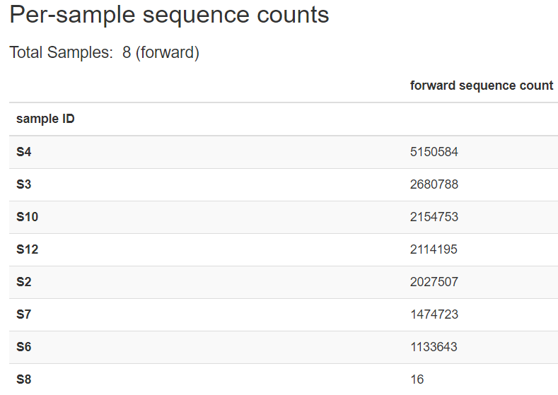

Yves Tchiechoua 18S Metegenomic analysis of Arbuscular Myrcorrhizal
Fungi (AMF) on Prunus africana Trees in Kenya and Cameroon
================
Bernice Waweru
Tue 22, Jun 2021

-   [Study details summary](#study-details-summary)
-   [Bioinformatics Analyses](#bioinformatics-analyses)
    -   [Analysis with `qiime2/2020.8`](#analysis-with-qiime220208)
        -   [Importing data into qiime2 and inspecting number and
            quality of
            reads](#importing-data-into-qiime2-and-inspecting-number-and-quality-of-reads)
        -   [Generating Feature (OTU) table with
            *Deblur*](#generating-feature-otu-table-with-deblur)
-   [Analysis in R](#analysis-in-r)
-   [Taxonomic assignemnts of reads with BWA and
    BLAST](#taxonomic-assignemnts-of-reads-with-bwa-and-blast)
-   [Session Information](#session-information)

## Study details summary

Soil samples were collected in four sites, two in Cameroon (*Mount
Cameroon (MC) and Mount Manengouba*) and two in Kenya (*Chuka forest
(CT) and Malava forest (MK)*). In all four sites, 20 mature *P.
africana* trees (≥ 30 cm dbh) were randomly selected, and rhizosphere
soil samples were collected from each tree at four cardinal points, and
at of about 20 cm distance from the trunk. Each sample consisted of
approximately 50 g of soil collected aseptically at a depth of 30 cm,
after removing the surface soil litter. The samples from each tree were
then pooled to form a composite sample of 200 g per tree. Subsequently,
the composite sample per tree was further pooled to form a composite
sample of 4 kg per site. A subsample of 500 g from each composite sample
was air-dried at ambient temperature for soil chemical analyses. The
remaining subsamples were taken to the laboratory and stored at 4 °C for
molecular analyses.

For each composite soil sample, 100 g of sample was groundand further a
duplicate subsample of 25g was used to extract gDNA using the DNeasy
PowerSoil kit following the supplier’s recommendation (Qiagen, Hilden,
Germany). Quantification and quality control of extracted DNA was done
using a NanoDrop™ 2000 spectrophotometer (Thermo Fisher Scientific, USA)
and 0.8 % agarose gel electrophoresis. The concentration of extracted
DNA was normalised to 25 ng/µl in a total volume of 50 µl. Amplification
of the small subunit of the rDNA (SSU rDNA) region was conducted using
the primer pairs **AML1/AML2** known to be specific primers for AMF
diversity (*Lee et al., 2008*).

The library construction was done using *Illumina Nextera XT DNA Sample
Preparation Kit* (Illumina, San Diego, USA) following the manufacturer’s
protocol. The quantified and sized amplicons were normalised and pooled
at equimolar concentrations, then submitted for sequencing to Illumina
MiSeq 300PE reads (2019-07-19).

All data obtained from the sequencing were deposited in the Sequence
Read Archive (SRA) at NCBI under accession number PRJNA657954.

## Bioinformatics Analyses

Original data from the MiSeq stored in folder
`/export/data/ilri/miseq/MiSeq2/MiSeq2Output2019/190719_M03021_0027_000000000-C8YMF/`.

This data was initially analyzed in 2020, and written up into a paper
submitted to frontiers in plant science. The reviewers raised some very
valid concerns that warranted the re-analysis of the data.

Majorly, the primers used to target AMF fungal sequences target a
variable region **795bp** in size. The sequencing platform used was
MiSeq to generate 300 bp paired-end reads. Translating to
non-overlapping reads with an almost **200bp** gap in the middle, as
only the 5’ and 3’ ends are sequenced (300bp on each side of the target
fragments). From literature, this are possibly two different variable
regions for the fungi.

We need to take advantage of both forward and reverse in the metagenomic
study, to identify taxa using both reads. Alternatively find a pipeline
that would enable identification of taxa arising from both reads of the
same sequence.

To start of, we use qiime2 to analyze R1 and R2 independently, then
utilize an inbuilt qiime2 plugin to compare taxonomic assignments from
the two reads.

### Analysis with `qiime2/2020.8`

#### Importing data into qiime2 and inspecting number and quality of reads

First we separate the R1 and R2 into different folders then supply the
path to qiime. We also create a folder to store all the data generated
with qiime, and also provide a path to the metadata file. We begin with
the forward(R1) reads and do the exact same analysis for the reverse(R2)
reads.

    module load qiime2/2020.8
    data_dir=/home/bngina/Fellows/Yves_Tchiechoua/qiime2_fwd_jan_2021
    met='/home/bngina/Fellows/Yves_Tchiechoua/orig_data/metadata.tsv'

    #import the data

    # adding the time command before the command is useful to know how long it took for the command to run

    time qiime tools import \
     --type 'SampleData[SequencesWithQuality]' \
     --input-path /home/bngina/Fellows/Yves_Tchiechoua/orig_data/fwd_reads \
     --input-format CasavaOneEightSingleLanePerSampleDirFmt \
     --output-path /home/bngina/Fellows/Yves_Tchiechoua/qiime2_fwd_jan_2021/yves_fwd.qza

    #visualize the imported data

    time qiime demux summarize \
     --i-data  ${data_dir}/yves_fwd.qza \
     --o-visualization ${data_dir}/yves_fwd.qzv

A look at the imported data;



The forward reads are of good quality as we can see in the figure above,
the quality seems to drop considerably after 265bp. Sample *S8* has very
few reads, only 16. The reverse reads are below.


The quality on the reverse reads is lower as expected for reverse reads
with the Illumina sequencing technology. Quality drops after 220bp.
Sample *S8* still has unexpectedly low reads at 16.

Double checking the sample sheet and Yves lab book confirms that the
sample indexes were assigned correctly. The Illumina work-flow is set to
de-multiplex the reads after sequencing and give per sample fastqs, with
the reads already assigned to samples and the indices removed. We dig
further to have a look at the de-multiplexing report that comes as part
of the results in the folder for the miseq run,


Above two tables reveal that sample *S8*, had a very low number of
indexes/adapters identified from it, so this is probably a problem that
originated from the lab. This sample will likely be dropped at some
point during the analysis due to the low number of reads.

#### Generating Feature (OTU) table with [*Deblur*](https://github.com/biocore/deblur "Deblur github page")

Qiime2 offers several pipelines for quality control and feature table
construction. The two main ones are
[DADA2](https://pubmed.ncbi.nlm.nih.gov/27214047/) and
[Deblur](https://msystems.asm.org/content/2/2/e00191-16).

Both of these are meant to analyze *16S bacterial* sequences by default,
using the Greengenes database for a positive filtering based approach to
identifying features/OTUS after sequence quality control.

We are working with *18S fungal* sequences. Of the two, *Deblur*
provides a plugin to provide a user-specified database to be used for
positive alignment-based filtering to identify sequences. We use this so
we can provide a custom fungal database that can be used.

YT provided the files required to import the maarjAM database into
qiime2. [This page](https://docs.qiime2.org/2021.4/tutorials/importing/)
provides some information on how to import various data into qiime2,
including fasta files and taxonomy files to be used as reference
databases.

Below are the commands we used on the cluster to import the files. This
was done in a batch script.

    #!/bin/bash
    #SBATCH -p batch
    #SBATCH -n 1
    #SBATCH -e /home/bngina/Fellows/Yves_Tchiechoua/batch_logs/quality.%N.%J.err
    #SBATCH -o /home/bngina/Fellows/Yves_Tchiechoua/batch_logs/quality.%N.%J.out
    #SBATCH -J maarJAM_tax


    module load qiime2/2020.8

    #import the maarJAM database sequence and taxonomy

    qiime tools import \
     --type 'FeatureData[Sequence]' \
     --input-path /home/bngina/Fellows/Yves_Tchiechoua/maarJAM_db/maarjAM.5.fasta \
     --output-path /home/bngina/Fellows/Yves_Tchiechoua/maarJAM_db/maarJAM_18S_refdb.qza


    qiime tools import \
     --type 'FeatureData[Taxonomy]' \
     --input-path /home/bngina/Fellows/Yves_Tchiechoua/maarJAM_db/maarjAM.id_to_taxonomy.5.txt \
     --output-path /home/bngina/Fellows/Yves_Tchiechoua/maarJAM_db/maarjAM.18S_taxanomy.qza

After importing the necessary files we then used to generate the feature
table using the custom databases as reference. One thing to note is when
working with *Deblur*, it will only work with the one set of the strands
provided. If for example your input `.qza` file with your sequences
includes both forward and reverse sequences, it will only pick the
forward sequences and truncate them to the specified length before
performing a positive based filter to look for 18S-like sequences in
your data. Due to this, we analyzed our sequences separately, the
forward and the reverse each as its own dataset. This is also a merit in
this study because there was no overlap between our forward and revere
data sequences.

We used the below commands to process the forward and reverse sequences
independently , only the input data changed. i.e forward or reverse.

    #we run the feature table creation with deblur, with a custom maarjAM-18S database, with truncate lengths based on the data as seen in previus images above.

    data_dir=/home/bngina/Fellows/Yves_Tchiechoua/qiime2_fwd_jan_2021
    met='/home/bngina/Fellows/Yves_Tchiechoua/orig_data/metadata.tsv'


    time qiime deblur denoise-other \
     --i-demultiplexed-seqs ${data_dir}/yves_fwd.qza \
     --i-reference-seqs /home/bngina/Fellows/Yves_Tchiechoua/maarJAM_db/maarJAM_18S_refdb.qza \
     --p-trim-length 265 \
     --p-sample-stats \
     --o-table ${data_dir}/yves_fwd_deblur_marjm_265_table.qza \
     --o-representative-sequences ${data_dir}/yves_fwd_deblur_marjm_265_repseqs.qza \
     --o-stats ${data_dir}/yves_fwd_deblur_marjm_265_stats.qza


    #visualize the output files

    #the statistics
    qiime metadata tabulate \
      --m-input-file ${data_dir}/yves_fwd_deblur_marjm_265_stats.qza \
      --o-visualization ${data_dir}/yves_fwd_deblur_marjm_265_stats.qzv

    #the feature table
    qiime feature-table summarize \
     --i-table ${data_dir}/yves_fwd_deblur_marjm_265_table.qza \
     --o-visualization ${data_dir}/yves_fwd_deblur_marjm_265_table.qzv \
     --m-sample-metadata-file ${met}


    #the rep sequences
    qiime feature-table tabulate-seqs \
     --i-data ${data_dir}/yves_fwd_deblur_marjm_265_repseqs.qza \
     --o-visualization ${data_dir}/yves_fwd_deblur_marjm_265_repseqs.qzv

The `qiime deblur denoise-other` command or plugin as they are referred
to within qiime2, generates three output file. A feature table with the
number of 18S like sequences (referred to as features, hence feature
table) and their counts as observed in each sample, a file with the
sequence of each feature and statistics about the filtering steps and
number of raw read sequences dropped and that passed to the next step.

Let us have a look at some them;

We start with the feature table;

[Feature table of forward reads generated with
deblur](embedded-images/yves_fwd_deblur_marjm_265_table.qzv) [Deblur
representative sequences table of forward reads generated with
deblur](embedded-images/yves_fwd_deblur_marjm_265_repseqs.qzv)

After generating the tables, the next step is to classify the sequences
into relevant taxonomic classifications. As we are using a custom
database, we train the qiime2 classifier to use out maarjAM database
using the recommended [plugin to train the
naive-bayes-classifier](https://docs.qiime2.org/2021.4/tutorials/feature-classifier/).

    #train the classifier with the sequences from the maarJAM database

    time qiime feature-classifier fit-classifier-naive-bayes \
     --i-reference-reads /home/bngina/Fellows/Yves_Tchiechoua/maarJAM_db/maarJAM_18S_refdb.qza  \
     --i-reference-taxonomy /home/bngina/Fellows/Yves_Tchiechoua/maarJAM_db/maarjAM.18S_taxanomy.qza \
     --o-classifier /home/bngina/Fellows/Yves_Tchiechoua/maarJAM_db/maarJAM_classifier.qza

Once the classifier is ready we use it to classify our feature
sequences, then generate a bar plot to have a looka the classification.

    # use the classifier to classifiy our reads from deblur identified using the maarJAM db

    time qiime feature-classifier classify-sklearn \
     --i-classifier /home/bngina/Fellows/Yves_Tchiechoua/maarJAM_db/maarJAM_classifier.qza \
     --i-reads  ${data_dir}/yves_fwd_deblur_marjm_265_repseqs.qza \
     --o-classification ${data_dir}/yves_fwd_deblur_marjm_265_repseqs_taxonomy.qza

    #visualize the taxonomic classification table and then do the barplots

    time qiime metadata tabulate \
     --m-input-file ${data_dir}/yves_fwd_deblur_marjm_265_repseqs_taxonomy.qza \
     --o-visualization ${data_dir}/yves_fwd_deblur_marjm_265_repseqs_taxonomy.qzv

    #the barplot

    time qiime taxa barplot \
     --i-table ${data_dir}/yves_fwd_deblur_marjm_265_table.qza \
     --i-taxonomy ${data_dir}/yves_fwd_deblur_marjm_265_repseqs_taxonomy.qza \
     --m-metadata-file ${met} \
     --o-visualization ${data_dir}/yves_fwd_deblur_marjm_265_repseqs_taxa_bar_plot.qzv

Once we have the feature tables and taxonomic classification, we export
the data for further processing with R. We use plugins within qiime2 for
this.

    #!/bin/bash

    #export files generated with qiime to be used for analysis with R packages

    module load qiime2/2020.8

    #directories

    fwd='/home/bngina/Fellows/Yves_Tchiechoua/qiime2_fwd_jan_2021'
    rev='/home/bngina/Fellows/Yves_Tchiechoua/qiime2_rev_jan_2021'
    met='/home/bngina/Fellows/Yves_Tchiechoua/orig_data/metadata.tsv'
    out='/home/bngina/Fellows/Yves_Tchiechoua/exported_files'

    qiime tools export \
     --input-path ${fwd}/yves_fwd_deblur_marjm_265_table.qza  \
     --output-path ${out}/yves_fwd_deblur_marjm_265_table

    #convert extracted biom table to tsv

    biom convert \
     --input-fp ${out}/yves_fwd_deblur_marjm_265_table/feature-table.biom \
     --output-fp ${out}/yves_fwd_deblur_marjm_265_table.tsv \
     --to-tsv \
    # --sample-metadata-fp ${met}


    qiime tools export \
     --input-path ${rev}/yves_rev_deblur_marjm_240_table.qza  \
     --output-path ${out}/yves_rev_deblur_marjm_240_table

    biom convert \
     --input-fp ${out}/yves_rev_deblur_marjm_240_table/feature-table.biom \
     --output-fp ${out}/yves_rev_deblur_marjm_240_table.tsv \
     --to-tsv \
     --sample-metadata-fp ${met}


    #open converted table change OTU ID to OTUID

    #export taxonomy table

    qiime tools export \
     --input-path ${fwd}/yves_fwd_deblur_marjm_265_repseqs_taxonomy.qza \
     --output-path ${out}/yves_fwd_deblur_marjm_265_repseqs_taxonomy.tsv

    # Manually change "feature ID" to "OTUID"

## [Analysis in R](https://github.com/bnwaweru/Metagenomics_Analysis/blob/master/Evaluating-result-feature-tables-with-R.md)

## [Taxonomic assignemnts of reads with BWA and BLAST](https://github.com/bnwaweru/Metagenomics_Analysis/blob/master/Analysis-of-raw-reads-with-BWA-and-BLAST.md)

## Session Information

``` r
devtools::session_info()
```

    ## - Session info ---------------------------------------------------------------
    ##  setting  value                       
    ##  version  R version 4.0.3 (2020-10-10)
    ##  os       Windows 10 x64              
    ##  system   x86_64, mingw32             
    ##  ui       RTerm                       
    ##  language (EN)                        
    ##  collate  English_United States.1252  
    ##  ctype    English_United States.1252  
    ##  tz       Africa/Nairobi              
    ##  date     2021-06-22                  
    ## 
    ## - Packages -------------------------------------------------------------------
    ##  package     * version date       lib source        
    ##  cachem        1.0.5   2021-05-15 [2] CRAN (R 4.0.5)
    ##  callr         3.7.0   2021-04-20 [2] CRAN (R 4.0.5)
    ##  cli           2.5.0   2021-04-26 [2] CRAN (R 4.0.5)
    ##  crayon        1.4.1   2021-02-08 [2] CRAN (R 4.0.5)
    ##  desc          1.3.0   2021-03-05 [2] CRAN (R 4.0.5)
    ##  devtools      2.4.2   2021-06-07 [2] CRAN (R 4.0.3)
    ##  digest        0.6.27  2020-10-24 [1] CRAN (R 4.0.3)
    ##  ellipsis      0.3.2   2021-04-29 [2] CRAN (R 4.0.5)
    ##  evaluate      0.14    2019-05-28 [2] CRAN (R 4.0.3)
    ##  fastmap       1.1.0   2021-01-25 [2] CRAN (R 4.0.5)
    ##  fs            1.5.0   2020-07-31 [2] CRAN (R 4.0.3)
    ##  glue          1.4.2   2020-08-27 [2] CRAN (R 4.0.3)
    ##  htmltools     0.5.1.1 2021-01-22 [2] CRAN (R 4.0.5)
    ##  knitr         1.33    2021-04-24 [2] CRAN (R 4.0.5)
    ##  lifecycle     1.0.0   2021-02-15 [2] CRAN (R 4.0.5)
    ##  magrittr      2.0.1   2020-11-17 [2] CRAN (R 4.0.3)
    ##  memoise       2.0.0   2021-01-26 [2] CRAN (R 4.0.5)
    ##  pkgbuild      1.2.0   2020-12-15 [2] CRAN (R 4.0.3)
    ##  pkgload       1.2.1   2021-04-06 [2] CRAN (R 4.0.5)
    ##  prettyunits   1.1.1   2020-01-24 [2] CRAN (R 4.0.3)
    ##  processx      3.5.2   2021-04-30 [2] CRAN (R 4.0.5)
    ##  ps            1.6.0   2021-02-28 [2] CRAN (R 4.0.5)
    ##  purrr         0.3.4   2020-04-17 [2] CRAN (R 4.0.3)
    ##  R6            2.5.0   2020-10-28 [2] CRAN (R 4.0.3)
    ##  remotes       2.4.0   2021-06-02 [2] CRAN (R 4.0.5)
    ##  rlang         0.4.11  2021-04-30 [2] CRAN (R 4.0.5)
    ##  rmarkdown     2.9     2021-06-15 [2] CRAN (R 4.0.3)
    ##  rprojroot     2.0.2   2020-11-15 [2] CRAN (R 4.0.3)
    ##  sessioninfo   1.1.1   2018-11-05 [2] CRAN (R 4.0.3)
    ##  stringi       1.6.2   2021-05-17 [2] CRAN (R 4.0.3)
    ##  stringr       1.4.0   2019-02-10 [2] CRAN (R 4.0.3)
    ##  testthat      3.0.2   2021-02-14 [2] CRAN (R 4.0.5)
    ##  usethis       2.0.1   2021-02-10 [2] CRAN (R 4.0.5)
    ##  withr         2.4.2   2021-04-18 [2] CRAN (R 4.0.5)
    ##  xfun          0.24    2021-06-15 [2] CRAN (R 4.0.3)
    ##  yaml          2.2.1   2020-02-01 [2] CRAN (R 4.0.3)
    ## 
    ## [1] C:/Users/BWaweru/OneDrive - CGIAR/Documents/R/win-library/4.0
    ## [2] C:/R/R-4.0.3/library
